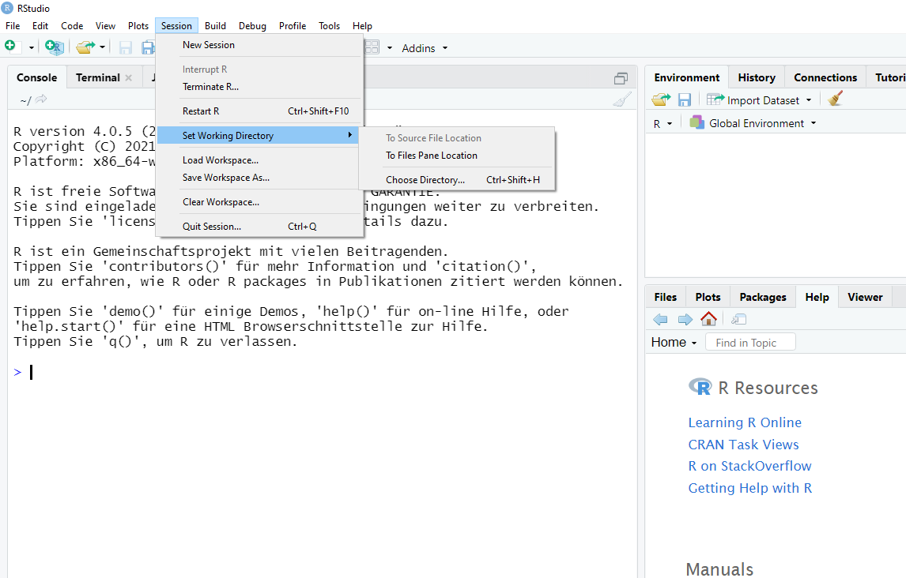

```{css, echo=FALSE}
.scrollChunk {
  max-height: 450px;
  overflow-y: auto;
  background-color: inherit;
}
```

```{r setup, include=FALSE, message = FALSE, warning=FALSE}
options(htmltools.dir.version = FALSE)
library(fontawesome)

################
# Packages
################
# if packages are not already installed, the function will install and activate them
usePackage <- function(p) {
  if (!is.element(p, installed.packages()[,1]))
    install.packages(p, dep = TRUE)
  require(p, character.only = TRUE)
}

usePackage("stargazer") # create tables
usePackage("Cairo") # environment to save graphics
usePackage("moments") # skewness, kurtosis

usePackage("epade") # easy plots like bar3d
# usePackage("gplots")

usePackage("tidyverse")

usePackage("fontawesome") 

usePackage("DT")

usePackage("afex")
usePackage("BayesFactor")
usePackage("ggstatsplot")

usePackage("rstatix")

usePackage("haven")

usePackage("janitor")


################
# Data
################
# load data
dat_twins <- read.csv2("data/tramo1998etal_twins.csv", header = TRUE, sep = ",")


# additional variable
dat_twins$IQ.cat <- cut(x = dat_twins$IQ, breaks = 3, labels = c("below average", "medium", "above average"))
# Data preparation
# str(dat_twins)

dat_twins$ID <- factor(dat_twins$ID)
dat_twins$IDZP <- factor(dat_twins$IDZP)
dat_twins$GR <- factor(dat_twins$GR)
dat_twins$GES <- factor(dat_twins$GES)
dat_twins$CC <- as.numeric(as.character(dat_twins$CC))
dat_twins$KU <- as.numeric(as.character(dat_twins$KU))
dat_twins$KG <- as.numeric(as.character(dat_twins$KG))
dat_twins$OG <- as.numeric(as.character(dat_twins$OG))


dat_twins$IQ.cat <- factor(dat_twins$IQ.cat, ordered = TRUE)
```


<!-- *********** NEW SLIDE ************** -->

## Workshop

This workshop consists of three parts:

1 Pep talk (*a speech which is intended to encourage someone to make more effort or feel more confident*)
  + first some basics
  
2 Knowledge Management: How to learn these things?!
  
3 Introduction to R
 + Overview
 + Objects
 + Data Structures
 + ...
 
4 Amazing Applications of R
  + typical analyses sequences in action
  + ...

<!-- *********** NEW SLIDE ************** -->


<!-- *********** HEADING ************** -->
---
class: heading,middle


Part 1: Pep talk


<!-- *********** HEADING ************** -->
---
class: heading,middle


Part 1: Pep talk - Some Basics


<!-- *********** NEW SLIDE ************** -->
---
## Definition: What is statistics?

- Statistics is the science of responsible data analysis.
- Statistics is a cross-sectional discipline that is characterized by a combination of knowledge in
  - Mathematics (abstraction, modeling, stochastics, numerics),
  - Computer science (programming, scientific computing),
  - Fields of application (life, natural or economic sciences, etc.).
- Statistical modeling allows the description of stochastic phenomena and thus supports the finding of rational decisions under uncertainty.


<br>

Encyclopedia Britannica: Statistics is the art and science of gathering, analyzing and making inferences from data. Originally associated with numbers gathered for governments, the subject now includes large bodies of method and theory.


<!-- *********** NEW SLIDE ************** -->
---
## The theoretical master-mind: The Statistician

**Statisticians:** theoretical driven, discussing terms like point estimates, margins of error, confidence intervals and are separated between  “Frequentists” and “Bayesians”
  - The Frequentist approach to statistics (and testing) is a method which makes predictions on the underlying truths of the experiment, using only data from the current experiment.
  - The Bayesian approach to statistics is a method that encodes past knowledge of similar experiments into a statistical device, known as prior. This prior is combined with current experiment data to make a conclusion on the test (knowledge accumulation).


<center>

</center>

<br>
<a href="https://cxl.com/blog/bayesian-frequentist-ab-testing/" target="_blank">https://cxl.com/blog/bayesian-frequentist-ab-testing/</a>


<!-- *********** NEW SLIDE ************** -->
---
## The modern (applied) statistician: The Data Scientist 

**Data scientists:** *data analysis is an art*; a process of data ingest, data transformation, exploratory data analysis, model selection, model evaluation, and data storytelling

<center>

</center>


<br>
see book: Peng, R. D., & Matsui, E. (2016). The Art of Data Science: A Guide for Anyone who Works with Data. Lulu.com. https://bookdown.org/rdpeng/artofdatascience/


<!-- *********** HEADING ************** -->
---
class: heading,middle


Part 1: Pep talk - The Real Talk


<!-- *********** NEW SLIDE ************** -->
---
## Why learn programming?!


(will I look like this cat?)

<center>

</center>


<br>
`r fa("fas fa-egg")` `r fa("fas fa-basket-shopping")`: https://osf.io/ytb8q

<!-- *********** NEW SLIDE ************** -->
---
## arguable reason: to impress someone


<center>

</center>

<br>
*Anyone wants to see impressive R Code in action?!*


<br>
<br>
<a href="https://stats.stackexchange.com/questions/423/what-is-your-favorite-data-analysis-cartoon" target="_blank">https://stats.stackexchange.com/questions/423/what-is-your-favorite-data-analysis-cartoon</a>


<!-- *********** NEW SLIDE ************** -->
---
## better reason: to embrace the complexity of our world - prediction


to appreciate uncertainty of our predictions (e.g. prediction paradox)
<center>

</center>

> random variables, distributions, expectations, confidence intervall, variance,...


<br>
see book: Silver, N. (2015). The Signal and the Noise: Why So Many Predictions Fail--but Some Don’t. Penguin Publishing Group.


<!-- *********** NEW SLIDE ************** -->
---
## better reason: to embrace the complexity of our world - system theory

<center>

</center>

<center>

</center>

> computational modelling, simulation...


<br>
see book: Meadows, D. H. (2008). Thinking in Systems: A Primer. Chelsea Green Pub.


<!-- *********** NEW SLIDE ************** -->
---
## down-to-earth reason: to get a job! - where to study?

- Göttingen: Master of Science (MSc) in Applied Statistics; https://www.uni-goettingen.de/en/421501.html
- Bamberg:  Masterstudiengang Survey-Statistik; https://www.uni-bamberg.de/miss/
- Trier: Master of Science (MSc) in Applied Statistics; https://www.uni-trier.de/universitaet/fachbereiche-faecher/fachbereich-iv/faecher/volkswirtschaftslehre/professuren/wirtschafts-und-sozialstatistik/studieren/applied-statistics-msc
- Tübingen: Kognitionswissenschaft (MSc); https://uni-tuebingen.de/fakultaeten/mathematisch-naturwissenschaftliche-fakultaet/fachbereiche/informatik/studium/studiengaenge/kognitionswissenschaft/
- Economics Master, ...


<!-- *********** HEADING ************** -->
---
class: heading,middle


Part 2: Knowledge Management


<!-- *********** NEW SLIDE ************** -->
---
## Check out the collection of materials!


see: https://docs.google.com/document/d/1Z40Rkux_Ysq15VziCJJH21ca07ipwN52dA_LFYIsZ2g/edit?usp=sharing

<br>
start reading: 
- Possible Learning Process
- Mixed -> Knowledge management and learning


<!-- *********** NEW SLIDE ************** -->
---
## Getting Things Done - workflow

**workflow:**
<center>

</center>


<br>
see book: Allen, D. (2015). Getting Things Done: The Art of Stress-Free Productivity. Penguin.


<!-- *********** NEW SLIDE ************** -->
---
## Getting Things Done - projects

**projects:**
*a project is anything we want to do that requires more than one action step. It’s therefore a mechanism to remember that, when we finish that first action step, there will still be something more to do*


1. Set up a project list, which is an index, in no particular order, of all your open loops (to dos).

2. For every project define at least the first next action step (OR waiting for, or calendar action).

3. The Projects list and project plans are typically reviewed in your GTD Weekly Review, ensuring each project has at least one current next action, waiting for, or calendar item.

4. It’s fine to have multiple next actions on any given project, as long as they are parallel and not sequential actions.

5. Projects are listed by the outcome you will achieve when you can mark it as done.
  + Effective project names motivate you toward the outcome you wish to achieve, and give you clear direction about what you are trying to accomplish.
  
<br>
<br>
=> that's how you set up a **learning plan**


<!-- *********** NEW SLIDE ************** -->
---
## How to learn - One Approach

**Organize your knowledge as a "Zettelkasten":**
<center>

</center>

- use Anki: https://apps.ankiweb.net/
- organize the "Zettel" by using Obsidian: https://obsidian.md/


<center>

</center>


Check out YouTube Video SpiegelMining – Reverse Engineering von Spiegel-Online: https://www.youtube.com/watch?v=-YpwsdRKt8Q


<!-- *********** HEADING ************** -->
---
class: heading,middle


Part 3: Introduction to R


<!-- *********** HEADING ************** -->
---
class: heading,middle


Part 3: Introduction to R - Overview

*Setting up your first project*

<!-- *********** NEW SLIDE ************** -->
---
## Main Literatur


* easy readable introduction R and statistics: Field, Andy, Jeremy Miles, and Zoë Field. Discovering Statistics Using R. SAGE, 2012.
* Resource for improving coding skills and deepening (technical) understanding of R:
  + Wickham, Hadley. Advanced R, Second Edition. CRC Press, 2019. https://adv-r.hadley.nz/.
  + Jones, Owen, Robert Maillardet, and Andrew Robinson. Introduction to Scientific Programming and Simulation Using R, Second Edition. CRC Press, 2014. https://nyu-cdsc.github.io/learningr/assets/simulation.pdf.
  
  
<br>
plus collected materials / workshops...


<!-- *********** NEW SLIDE ************** -->
---
## Introduction to R

* R is a programming language and tool for statistical computing and data analysis
* consist of basic functionalities (i.e., objects and functions) as well as packages that allow for robust and efficient coding
* in R are multiple object-oriented programming (OOP) included like S3, R6, S4, ..., enables *polymorphism* (use the same function form for different types of input)


```{r}
summary(c(TRUE, TRUE, FALSE, TRUE))
```


```{r}
summary(rnorm(n = 100, mean = 0, sd = 20))
```

Important:
* Everything that exists is an object.
* Everything that happens is a function call.


<!-- *********** NEW SLIDE ************** -->
---
## Side-Note: Polymorphism?

```{r}
methods(generic.function = "summary")[1:20]
```

other important functions are: 

```{r eval=FALSE}
?typeof
?class
?mode
```

<!-- *********** NEW SLIDE ************** -->
---
## set your working directory

* every time when starting R set your working directory (or better create an R Project*)

<br>

<center>

</center>

*you could also use the R API: 

```{r eval=FALSE}
# sets the directory of location of this script as the current directory
setwd(dirname(rstudioapi::getSourceEditorContext()$path))
```

<!-- *********** NEW SLIDE ************** -->
---
## your workflow

! **modular programming**

<br>

if using R projects: 
* Create a project folder
* In this folder, organize your file in subfolders (e.g., data)
* All filepaths in your script(s) are specified relative to the folder’s top level
* Thus, your working directory is always this top level


<!-- *********** NEW SLIDE ************** -->
---
## Side-Note: modular programming?

you separate your programs into separate functional units (modules). Each module does a well-defined task and the modules are called by one-another as needed. Typically, the state of each module is encapsulated and only supposed to be altered by the functions from that module.

<center>

</center>


> Modular programming decomposes a large program into modules!


<!-- *********** NEW SLIDE ************** -->
---
## Side-Note: modular programming - Importance

without following the principle of modular programming (*or sometimes structured programming*) you cannot set up a typical data science project:


<center>

</center>


see in detail: https://r4ds.had.co.nz/introduction.html


<!-- *********** NEW SLIDE ************** -->
---
## RStudio Projects

When using a project, RStudio will automatically set your working directory to the location of the project file.

Additionally, RStudio will

* load .RData files
* load .RHistory files
* open source files (scripts)
* restore RStudio settings

This will particularly benefit your workflow when collaborating with others/sharing your script, for example by using

<center>

</center>

[https://codehorizons.com/making-your-first-github-r-project/](https://codehorizons.com/making-your-first-github-r-project/)


<!-- *********** NEW SLIDE ************** -->
---
## hands-on: set up a project!

and remember the philosophy of R:

**Everything that exists is an object.**

**Everything that happens is a function call.**


<center>

</center>


<!-- *********** HEADING ************** -->
---
class: heading,middle


Part 3: Introduction to R - Objects

*Using R as a sophisticated calculator*


<!-- *********** NEW SLIDE ************** -->
---
## ??????! I am lost


Is anyone lost?

<br>
<br>


<center>

</center>


<!-- *********** NEW SLIDE ************** -->
---
## the very basics


.pull-left[
**Explanation:**

1 get help 

2 assignments

3 operators

4 comparisons

5 comments: everything that follows #

<br>
> case sensitive: usage of CAPITAL and small letters matters!

]

.pull-right[
**R commands:**

1
```{r eval=FALSE}
?topic, help(topic)
```
2
```{r eval=FALSE}
x <- 5 (recommended), x = 5, 5 -> x
```
3
```{r eval=FALSE}
+, -, *, /, ^, &, &&; see help("+")
```
4
```{r eval=FALSE}
== , != , >, >= , <, <=; see help("=")
```
5
```{r eval=FALSE}
# I am a comment
```
]


<!-- *********** NEW SLIDE ************** -->
---
## basic data structures


.pull-left[
**Explanation:**

1 integer

2 double

3 logical

4 character

5 missings
]

.pull-right[
**R commands:**

1
```{r eval=FALSE}
1; 2; 301L
```
2
```{r eval=FALSE}
1.0; .141; 1.23e-3; NaN; Inf; -Inf
```
3
```{r eval=FALSE}
TRUE; FALSE #(not T, F!)
```
4
```{r eval=FALSE}
"hello"; "I'm a string"
```
5
```{r eval=FALSE}
NA
```
]


<!-- *********** NEW SLIDE ************** -->
---
## basic data structures - construction & coercion I


.pull-left[
**Explanation:**

Coercion: When you call a function with an argument of the wrong type, R will try to coerce values to a different type so that the function will work. R will convert from more specific types to more general types.


**R commands:**

you define a vector x as follows
```{r eval=TRUE}
x <- c(1, 2, 3, 4, 5)
x
typeof(x); class(x)
```
]

.pull-right[
**R commands:**


change the second element of the vector to the word “hat.”
```{r eval=TRUE}
x[2] <- "hat"
x
typeof(x); class(x)
```
]


<!-- *********** NEW SLIDE ************** -->
---
## basic data structures - construction & coercion II


.pull-left[
**Explanation:**

Coercion: 
* coerce to a type xxx by as.xxx()
* check if xxx is a specific type by is.xxx()
* when combining different data types, they will be coerced to the most flexible type
* coercion often happens automatically

]

.pull-right[
**R commands:**

```{r eval=TRUE}
x <- 1
is.numeric(x)
as.logical(x)
x <- c(FALSE, FALSE, TRUE)
as.numeric(x)
```
]


<!-- *********** NEW SLIDE ************** -->
---
## basic data structures - represent nothing


.pull-left[
**Explanation:**

In R, there are three ways to represent 'nothing', but the reason for the missingness of the information can be distinguished:
* NA: missing sample values, impossible coercion, . . .
* NaN: undefined results in mathematical operation (e.g. log(-1), 1/0)
* NULL: null pointer, i.e. pointer in empty/undefined memory
]

.pull-right[
**R commands:**

```{r eval=TRUE}
c(3, NA)
c(3, 0/0)
c(3, NULL)
max(3, NA)
```
]


<!-- *********** NEW SLIDE ************** -->
---
## basic data structures - Infinity


.pull-left[
**Explanation:**

Some mathematical operations can be performed with Inf and -Inf:
]

.pull-right[
**R commands:**

```{r eval=TRUE}
max(3, Inf)
min(3, Inf)
c(Inf + Inf, (-Inf) * Inf, Inf - Inf)
```
]


<!-- *********** NEW SLIDE ************** -->
---
## hands-on: try out the basic data structures


The bored people can open the R Reference Card 2.0 and try out more fancy stuff: https://cran.r-project.org/doc/contrib/Baggott-refcard-v2.pdf


<center>

</center>

<br>
check out also the folder "additional scripts -> Basic Vocabulary"


<!-- *********** HEADING ************** -->
---
class: heading,middle


Part 3: Introduction to R - Data Structures

*We are going to face the 10th dimension (wuuuuhu)*


<!-- *********** NEW SLIDE ************** -->
---
## ??????! I am not lost but thirsty


Anyone needs a coffee / break?

<br>
<br>

<center>

</center>


<!-- *********** NEW SLIDE ************** -->
---
## complex data types


complex data structures in R can be organized by their dimensionality and if all their contents are of the same type (homogeneous), or not (heterogeneous)

.pull-left[
**homogeneous:**

* 1d atomic vector
```{r eval=FALSE}
1:10; c(1,2,3,4,5,6,7,8,9,10)
```

* 2d matrix
```{r eval=FALSE}
matrix(data = NA, nrow = 2, ncol = 3)
```

* nd array
```{r eval=FALSE}
array(1:60, dim=c(3,4,5))
```
]

.pull-right[
**heterogeneous:**

* 1d list
```{r eval=FALSE}
list(1:10, letters)
```

* 2d matrix data frame
```{r eval=FALSE}
data.frame(id = 1:26, 
           letters = letters, 
           constant = "Hello World")
```
]


> we need depending on the issue we are facing different database paradigms! 

check out Fireship YouTube Video: https://youtu.be/W2Z7fbCLSTw


<!-- *********** NEW SLIDE ************** -->
---
## complex data types - very rare in psychology (social science)

often we have "simple" rectangular data, which are made of (values are associated with a variable and a observation):
* **column**, which represents a variable (like ID)
* **rows**, which represents an instance of data in the data set (like a participant)

```{r}
DT::datatable(dat_twins, options = list(pageLength = 5))
```


<!-- *********** NEW SLIDE ************** -->
---
## every data set should be accompanied by a codebook

Sample size N = 20
Variables (columns):
* ID: Identifier of the individual person
* IDZP: Identifier of the twin pair
* GR: Birth order
* GES: Sex (1 = male, 2 = female)
* OG: Surface area of the cerebral cortex in cm2
* VG: Volume of the forebrain in cm3
* CC: Area of the corpus callosum in cm2
* KU: Circumference of head in cm
* IQ: Intelligence quotient
* KG: Body weight in kg
* additionally IQ.cat: grouped intelligence quotient in 3 groups


Study: https://n.neurology.org/content/50/5/1246


<!-- *********** NEW SLIDE ************** -->
---
## Side-Note: the most scientific study ever


Hypothesis: the size and shape of the human forebrain predict intelligence!

<br>
the mighty correlation matrix:

```{r}
round(x = cor(x = dat_twins[, c("VG", "CC", "KU", "KG", "IQ")], 
              method = "spearman"), digits = 2)
```

> What is your opinion?

* Spearman correlation coefficient only maps monotone relationships; r_SP > 0, if in tendency x large -> also y large and vice versa; indicate a monotonic relationship in the same direction (not linear relationship!)
  + to be applied especially when the data are not normally distributed, the scales have unequal answering options, for very small sample sizes (or better use concordance measures)


<!-- *********** NEW SLIDE ************** -->
---
## complex data types - the SQL side of the story


for huge data sets you could use, for example SQL (Structured Query Language), which is a domain-specific language used in programming and designed for managing data held in a relational database management system; check out: https://www.dbis.informatik.uni-goettingen.de/Mondial/  

> multiple relational databases are matched by a primary key / multiple primary keys

and complex data bases can be depicted for example as entity relationship models: 


<center>

</center>


<!-- *********** NEW SLIDE ************** -->
---
## complex data types - add attributes


All objects can have arbitrary additional attributes, used to store metadata about the object

* can be thought of as a named list (with unique names); other frequently encountered attributes: "dimnames", "names", "class"(!)
* can be accessed individually with attr() or all at once (as a list) with attributes()
* arrays are simply vectors with a "dim"-attribute.
* factor is a vector with attribute levels


.pull-left[

```{r eval=TRUE}
dat <- data.frame(id = 1:26, 
           letters = letters, 
           constant = "Hello World")
head(dat)
```

]

.pull-right[

```{r eval=TRUE}
attr(x = dat, which = "names")
attributes(x = dat)
```

]


<!-- *********** NEW SLIDE ************** -->
---
## hands-on: try out the different data structures

Hint: we have the following data structures: 

.pull-left[
**homogeneous:**

* 1d atomic vector
```{r eval=FALSE}
1:10; c(1,2,3,4,5,6,7,8,9,10)
```
* 2d matrix
```{r eval=FALSE}
matrix(data = NA, nrow = 2, ncol = 3)
```
* nd array
```{r eval=FALSE}
array(1:60, dim=c(3,4,5))
```
]

.pull-right[
**heterogeneous:**

* 1d list
```{r eval=FALSE}
list(1:10, letters)
```

* 2d matrix data frame
```{r eval=FALSE}
data.frame(id = 1:26, 
           letters = letters, 
           constant = "Hello World")
```
]

If you want to save your data structures to an R object e.g. write: 
```{r eval=FALSE}
myFirstVector <- 1:10
```


<!-- *********** HEADING ************** -->
---
class: heading,middle


Part 3: Introduction to R - Subsetting

*From the 10th dimension down to spaceship earth again.*


<!-- *********** NEW SLIDE ************** -->
---
## ??????! When you had to debug your first error messages


recommended TV shows: I'm a Celebrity … Get Me Out of Here! (also valuable: Get the F*ck out of my House)

<br>
<br>

<center>

</center>


<!-- *********** NEW SLIDE ************** -->
---
## Subsetting - Theory

* there are three subsetting operators: [, [[, and $
* the three types of subsetting:
  + Positive integers return elements at the specified positions.
  + Logical vectors select elements where the corresponding
  + logical value is TRUE; application of logical expressions.
* character vectors to return elements with matching names.
* important differences in behavior of different objects (e.g., vectors, lists, factors, matrices, and data frames)
* more advanced subsetting, in particular in combination with complex logical expressions, can be done using the functions subset() and which().
* (the default drop=TRUE simplifies the data type of the result.)


<br>
you "only" need to learn the behavior of 

* Positive Integers
* Negative integers
* Logical vectors
* Character vectors

on different types of data!


<!-- *********** NEW SLIDE ************** -->
---
## Subsetting - Atomic Vector I


```{r}
# define an R Object
x <- c(2.1, 4.2, 3.3, 5.4)
```


.pull-left[
**Positive Integers:**

```{r, eval=FALSE}
x[c(3, 1)]
#> [1] 3.3 2.1
x[order(x)]
#> [1] 2.1 3.3 4.2 5.4

# Duplicate indices will duplicate values
x[c(1, 1)]
#> [1] 2.1 2.1

# Real numbers are silently truncated to integers
x[c(2.1, 2.9)]
#> [1] 4.2 4.2
```


]

.pull-right[
**Negative integers:** exclude elements at the specified positions

```{r eval=FALSE}
x[-c(3, 1)]
#> [1] 4.2 5.4
```

**Logical vectors:** select elements where the corresponding logical value is TRUE

```{r eval=FALSE}
x[c(TRUE, TRUE, FALSE, FALSE)]
#> [1] 2.1 4.2
x[x > 3]
#> [1] 4.2 3.3 5.4
```
]


<!-- *********** NEW SLIDE ************** -->
---
## Subsetting - Atomic Vector II


```{r}
# define an R Object
x <- c(2.1, 4.2, 3.3, 5.4)
```

.pull-left[
**Logical vectors:** select elements where the corresponding logical value is TRUE

```{r, eval=TRUE}
x[x>5]
x>5
```
]

.pull-right[
**Character vectors:** return elements with matching names

```{r eval=FALSE}
(y <- setNames(x, letters[1:4]))
#>   a   b   c   d 
#> 2.1 4.2 3.3 5.4
y[c("d", "c", "a")]
#>   d   c   a 
#> 5.4 3.3 2.1

# Like integer indices, you can repeat indices
y[c("a", "a", "a")]
#>   a   a   a 
#> 2.1 2.1 2.1

# names are always matched exactly
z <- c(abc = 1, def = 2)
z[c("a", "d")]
#> <NA> <NA> 
#>   NA   NA
```
]


<!-- *********** NEW SLIDE ************** -->
---
## Subsetting - Matrices I

Setting up your matrix: 

```{r}
# ?matrix
a <- matrix(data = 1:9, nrow = 3) # ncol, ...
colnames(a) <- c("A", "B", "C")
a
```


<!-- *********** NEW SLIDE ************** -->
---
## Subsetting - Matrices II


```{r}
a <- matrix(1:9, nrow = 3)
colnames(a) <- c("A", "B", "C")
```


.pull-left[

```{r, eval=FALSE}
a[1:2, ]
#>      A B C
#> [1,] 1 4 7
#> [2,] 2 5 8
a[c(TRUE, FALSE, TRUE), c("B", "A")]
#>      B A
#> [1,] 4 1
#> [2,] 6 3
a[0, -2]
#>      A C
```

]

.pull-right[
more advanced: you can also subset higher-dimensional data structures with an integer matrix (or, if named, a character matrix). Each row in the matrix specifies the location of one value, and each column corresponds to a dimension in the array

```{r eval=FALSE}
vals <- outer(1:5, 1:5, FUN = "paste", sep = ",")
select <- matrix(ncol = 2, byrow = TRUE, c(
  1, 1,
  3, 1,
  2, 4
))
vals[select]
#> [1] "1,1" "3,1" "2,4"
```

]
 


<!-- *********** NEW SLIDE ************** -->
---
## Subsetting - Data frames I 

Setting up your data frame:

```{r}
# ?data.frame
df <- data.frame(x = 1:3, y = 3:1, z = letters[1:3]) # stringsAsFactors !
df
```


Important to note: there is a equivalent of data.frames in more "modern" R frameworks called "tibble" (has enhanced printing, ...): 

```{r}
# ? tibble::tibble
tibble::tibble(x = 1:3, y = 3:1, z = letters[1:3])
```


<!-- *********** NEW SLIDE ************** -->
---
## Subsetting - Data frames II 


.pull-left[

The most important subsetting to get data of certain objects of observation:

```{r, eval=FALSE}
df[df$x == 2, ]
#>   x y z
#> 2 2 2 b
df[c(1, 3), ]
#>   x y z
#> 1 1 3 a
#> 3 3 1 c
```


the dollar sign is a shorthand operator: "x$y" is roughly equivalent to "x[["y"]]"; often used to access variables in a data frame

```{r, eval=TRUE}
df$x
```
]

.pull-right[

```{r eval=FALSE}
# There are two ways to select columns from a data frame
# Like a list
df[c("x", "z")]
#>   x z
#> 1 1 a
#> 2 2 b
#> 3 3 c
# Like a matrix
df[, c("x", "z")]
#>   x z
#> 1 1 a
#> 2 2 b
#> 3 3 c
```

]


<!-- *********** NEW SLIDE ************** -->
---
## Subsetting - Lists I 

Setting up your list:

```{r}
# ?list
x <- list(1:3, "a", 4:6)
x
```


<!-- *********** NEW SLIDE ************** -->
---
## Subsetting - Lists II 

```{r}
x
```

is equivalent to the following representation: 


<center>

</center>


<!-- *********** NEW SLIDE ************** -->
---
## Subsetting - Lists III 

When extracting a single element, you have two options: you can create a smaller train, i.e., fewer carriages, or you can extract the contents of a particular carriage. This is the difference between [ and [[:


<center>

</center>


When extracting multiple (or even zero!) elements, you have to make a smaller train:

<center>

</center>


<!-- *********** NEW SLIDE ************** -->
---
## Subsetting - simplifying vs. preserving

* **simplifying subsets** simplest possible data structure, that can represent the output
* **preserving subsets** keeps the structure of the output the same as the input (better for programming)

<br>
Example with lists, which return the object inside the list, not a single element list

```{r}
y <- list(a = 1:2, b = letters[1:3])
str(y[1])
str(y[[1]])
```


<!-- *********** NEW SLIDE ************** -->
---
## Subsetting - data frames most useful I 

Do you remember our twin pair data set?

```{r}
DT::datatable(dat_twins, options = list(pageLength = 5))
```

Three questions:
* How do we get only the twins with IQ higher than 120?
* How do we get only the twins with IQ lower than 100 and body weight higher than 100?
* How can we order the data set according to IQ?


<!-- *********** NEW SLIDE ************** -->
---
## Subsetting - data frames most useful II 

How do we get only the twins with IQ higher than 120?

```{r}
dat_twins[dat_twins$IQ > 120, ]

## identical function
subset(dat_twins, IQ > 120)
```


<!-- *********** NEW SLIDE ************** -->
---
## Subsetting - data frames most useful III 

How do we get only the twins with IQ lower than 100 and body weight higher than 100?

```{r}
dat_twins[dat_twins$IQ < 100 & dat_twins$KG > 100, ] # ! only single logical operator
```

> such expressions could be of any complexity


<!-- *********** NEW SLIDE ************** -->
---
## Subsetting - data frames most useful IV

How can we order the data set according to IQ?

```{r}
order(dat_twins$IQ)
head(dat_twins[order(dat_twins$IQ), ])
# dat_twins[, order(names(dat_twins))] # order data set alphabetically
```

> ordering according to the primary key (ID variable) is often necessary before matching data


<!-- *********** HEADING ************** -->
---
class: heading,middle


Part 3: Introduction to R - Flow control

*That's how adults play Looping Louie!*


<!-- *********** NEW SLIDE ************** -->
---
## ??????! Before running circles we need a break right?!

Time to learn p-hacking for experts (in German we say "T-Test rechnen bis die Tasten glühen")
<br>
<br>


.pull-left[

<center>

</center>

]

.pull-right[

Instead of p-hacking why not just starting a research program to solve finally this paradox:

<center>

</center>
]


<!-- *********** NEW SLIDE ************** -->
---
## Flow control - vocabulary

There are some new words to learn if you want to become a flow control master: 

```{r, eval=FALSE}
# Control flow
if - &&, || (short circuiting)
for, while
next, break
switch
ifelse

# Debugging
stop
warning
message
```


<!-- *********** NEW SLIDE ************** -->
---
## Flow control - if statement I

Normally we want to combine if statements with loops (plus functions).

<br>
**if statements** have the following form: 

```{r eval=FALSE}
## abstract representation
if (condition) true_action
if (condition) true_action else false_action
```

in action:

```{r eval=TRUE}
x1 <- if (TRUE) 1 else 2 # the experts write code like this!
x1
x2 <- if (FALSE) 1 else 2
x2
```


<!-- *********** NEW SLIDE ************** -->
---
## Flow control - if statement II


```{r eval=TRUE}
greet <- function(name, birthday = FALSE) {
  paste0(
    "Hi ", name,
    if (birthday) { # but I prefer this way of writing code
      " and HAPPY BIRTHDAY"
    } else{
      " and you do not have BIRTHDAY"
    }
  )
}
greet("Maria", FALSE)
greet("Jaime", TRUE)
```


<!-- *********** NEW SLIDE ************** -->
---
## Flow control - if statement III

If statements can be arbitrarily complex:

```{r eval=TRUE}
x <- 20

if (x > 30) {
  print("x > 30")
} else if (x <= 30 && x > 20) {
  print("x <= 30 && x > 20")
} else{
  print("everything else")
}
```


An important function is also the ifelse() function: 

```{r eval=TRUE}
x <- 1:10
ifelse(x %% 2 == 0, "even", "odd")
```


<!-- *********** NEW SLIDE ************** -->
---
## Flow control - For Loop


.pull-left[

<center>

</center>

]

.pull-right[

```{r eval=TRUE}
for(i in 1:10) { # Head of for-loop
  x1 <- i^2 # Code block
  print(x1) # Print results
}
```

]

see multiple examples: https://statisticsglobe.com/for-loop-in-r


<!-- *********** NEW SLIDE ************** -->
---
## Flow control - Why Awesome?! I 

Imagine we want to drawn for the prices of diamonds for every different quality of the cut; data set with over 50.000 diamonds


```{r eval=TRUE}
# ? diamonds
# How many cuts? 
levels(diamonds$cut)
# Is there a difference in price?
diamonds %>%
  group_by(cut) %>%
  summarize(mean(price))
```


<!-- *********** NEW SLIDE ************** -->
---
## Flow control - Why Awesome?! II

Imagine we want to drawn for the prices of diamonds for every different quality of the cut; data set with over 50.000 diamonds

```{r eval=FALSE}
for(c in levels(diamonds$cut)) {
  cat("quality of cut: ", c, "\n")
  tmp <- diamonds$price[diamonds$cut == c]
  cat("    > # of diamonds: ", length(tmp), "\n")
  cat("    > skewness: ", moments::skewness(tmp), "\n")
  cat("    > kurtosis: ", moments::kurtosis(tmp), "\n")
  hist(tmp, main = c, xlab = "price")
  abline(v = mean(tmp), col = "red") # add mean
  
  if(length(tmp) < 5000){
    message("Oh no there are not even 5000 diamonds.")
  }
}
```


> by using print() or cat() you can print additional information in the console

> by adding if() statements you can implement a complex logical structure in your for loop


<!-- *********** NEW SLIDE ************** -->
---
## Subsetting - for loop useful example I  

In the twin data set we have the variable "IDZP" (identifier of the twin pair)

```{r}
DT::datatable(dat_twins, options = list(pageLength = 5))
```

```{r}
table(dat_twins$IDZP)
```


<!-- *********** NEW SLIDE ************** -->
---
## Subsetting - for loop useful example II

Compute the mean difference of IQ for every twin pair: 

```{r}
mean_twinPairs <- double(10) # empty vector made up of 0 to fill up
h=1 # index variable
for(t in levels(dat_twins$IDZP)) {
  # cat("twin pair: ", t, "\n")
  tmp <- dat_twins$IQ[dat_twins$IDZP == t]
  # cat("    > IQ values: ", tmp, "\n")

  mean_twinPairs[h] <- diff(tmp)
  h=h+1 # increase index variable by 1
}

mean_twinPairs
```


<!-- *********** HEADING ************** -->
---
class: heading,middle


Part 3: Introduction to R - Writing Functions

*Statisticians are lazy as hell, that's why we write code only once!*


<!-- *********** NEW SLIDE ************** -->
---
## ?!!! Never get completely lost anymore

Otherwise it could get dark (at least your mood when writing code)!


<br>
<br>

<center>

</center>


<!-- *********** NEW SLIDE ************** -->
---
## Writing Functions - vocabulary

Also here are some new words to learn if you want to program your own function:

```{r, eval=FALSE}
# Functions to do with functions
function
missing
return, invisible
```


<!-- *********** NEW SLIDE ************** -->
---
## Writing Functions - Theory I

* R, at its heart, is a functional programming language. This means that it provides many tools for the creation and manipulation of functions.
* The structure of a function is given by

```{r, eval=FALSE}
function ( <arglist> ){ <body> }
```

* the keyword function indicates the beginning of a function
* arguments <arglist> are defined by comma-separated key-value-pairs
* <body> is a block of R commands which are executed by the function


<!-- *********** NEW SLIDE ************** -->
---
## Writing Functions - Theory II

All R functions are objects and consist of three parts:
* body() the code inside the function.
* formals() the list of arguments which controls how you can call the function.
* environment() the 'map' of the location of the function's variables. If the environment isn't displayed, it means

```{r, eval=TRUE}
f <- function(x){
  square <- x^2 # compute the square
  return(square) # return the value
}
```


.pull-left[

```{r eval=TRUE}
formals(f)
body(f) 
```

]

.pull-right[

```{r eval=TRUE}
environment(f)
```

]


<!-- *********** NEW SLIDE ************** -->
---
## Writing Functions - Human Interaction is Incoming I

Recommendation of Xie (chief software engineer of R): 

> Avoid the commands that require human interaction: human input can be highly unpredictable; e.g., we do not know for sure which file the user will choose if we pop up a dialog box asking the user to choose a data file...


The user breaks our function: 
```{r, eval=TRUE, error=TRUE}
f
f(x = "I am a string!")
```


<!-- *********** NEW SLIDE ************** -->
---
## Writing Functions - Human Interaction is Incoming II

If you writing functions it is good practice to control for the input:

```{r, eval=TRUE, error=TRUE}

f <- function(x){
  if(is.numeric(x)){
    square <- x^2 # compute the square
    return(square) # return the value
  }else{
    message("You should provide a numeric value / numeric vector.")
    return(NULL)
  }

}

f(x = "I am a string!")
```


<!-- *********** NEW SLIDE ************** -->
---
## Writing Functions - Human Interaction is Incoming III

If you have a "character" argument like "sex = c("Male", "Female")" you can check the provided values by: 

* match.arg matches arguments against a table of candidate values specified by choices

```{r, eval=FALSE}
match.arg(arg, choices, several.ok = FALSE)
```

* missing argument will be replaced with the first candidate

```{r, eval=TRUE, error=TRUE}
talk_about_sex <- function(sex = c("Male", "Female", "Non-binary")) {
  match.arg(sex)
}

talk_about_sex("F") # partial matching (not good practice)
talk_about_sex()
talk_about_sex("W")
```


<!-- *********** NEW SLIDE ************** -->
---
## Writing Functions - Function Arguments

* formals() the list of **arguments** which controls how you can call the function.
  + Function arguments in R can have default values.
  + They can be also defined in terms of other arguments.
  + You can determine if an argument was supplied or not with the missing() function.


```{r, fig.show="hold", out.width="20%"}
myplot <- function(x, y, mycol = 'red') {
  if (missing(y)) {
    y <- x
    x <- 1:length(y)
    }
  plot(x, y, col = mycol)
}
par(mar = c(4, 4, .1, .1))
myplot(x = 1:20)
myplot(x = 1:20, y = rnorm(20), mycol='darkgreen')
```


<!-- *********** NEW SLIDE ************** -->
---
## Writing Functions - examples I  

Using the **Cairo** package you could save your graphics directly as files to your computer in great resolution:

```{r, eval=FALSE}
############################################################################
##### save_graphic()
# save graphic object as png file
############################################################################
save_graphic <- function(filename){
  tmp <- paste(filename, ".png", sep = "")
  Cairo::Cairo(file=tmp,
               type="png",
               units="px",
               width=2500,
               height=1700,
               pointsize=44, # text size is artifically shrunked when saved 
               dpi= "auto",
               bg = "white")
}

dev.off()
save_graphic(filename = "myFirstPlot")
plot(cars$speed, cars$dist)
dev.off()
```

(also possible to use for example ggsave() from the **ggplot2** package)


<!-- *********** NEW SLIDE ************** -->
---
## Writing Functions - examples II  

Using the **stargazer** package you could save your easily set up summary statistics in the APA 7 format:

.scrollChunk[
```{r, eval=FALSE}
############################################################################
##### getDescriptives()
# get multiple summary statistics to R console AND / OR to HTML
############################################################################
### functionals:
# dataset = dat_twins
# variables = c("IQ", "KG")
# nameAPAtable = "myFirstTable"
getDescriptives <- function(dataset = NULL,
                            variables = NULL,
                            nameAPAtable = NULL){
  x <- dataset[, variables]
  ## table
  tmp_descriptives <- sapply(x, function(x) c(
    "Mean"= mean(x, na.rm=TRUE),
    "SD" = sd(x, na.rm=TRUE),
    "Median" = median(x, na.rm=TRUE),
    "CoeffofVariation" = sd(x, na.rm=TRUE)/mean(x, na.rm=TRUE),
    "Minimum" = min(x, na.rm=TRUE),
    "Maximun" = max(x, na.rm=TRUE),
    "Lower Quantile" = as.numeric(quantile(x,0, na.rm=TRUE)),
    "Upper Quantile" = as.numeric(quantile(x,1, na.rm=TRUE)),
    "Skewness" = moments::skewness(x = x, na.rm=TRUE),
    "Kurtosis(-3)" = moments::kurtosis(x = x, na.rm=TRUE) -3,
    "KS-Test" = ks.test(x = x, y = "pnorm", mean(x, na.rm=TRUE), sd(x, na.rm=TRUE))$p.value
  )
  )
  tmp_descriptives <- round(x = tmp_descriptives, digits = 2)
  ## as APA 7 table in HTML using stargazer
  ## round digits
  out_tmp <- round(x = t(tmp_descriptives), digits = 2)
  if(!is.null(nameAPAtable)){
    notNeeded <- capture.output(stargazer(out_tmp, type = "html", summary = FALSE,
                                          out = paste0(nameAPAtable, ".html")))
  }
  return(tmp_descriptives)
}


getDescriptives(dataset = dat_twins, 
                variables = c("IQ", "KG"), 
                nameAPAtable = "myFirstTable")
```
]


<!-- *********** HEADING ************** -->
---
class: heading,middle


Part 3: Introduction to R - File and Data Management

*Of all the things I've lost, I miss my mind the most. (Mark Twain)*


<!-- *********** NEW SLIDE ************** -->
---
## ! we are now on track for our first sophisticated program

The management of your files, your data, your code is key. Keep on riding... 

<br>
<br>

<center>

</center>


<!-- *********** NEW SLIDE ************** -->
---
## organize your program in modules I

.pull-left[

at best use R projects and separate your programs / code / files into separate functional units (modules) / folders: 
* Create a project folder
* In this folder, organize your file in subfolders (e.g., data)
* All file paths in your script(s) are specified relative to the folder’s top level

<center>

</center>


]

.pull-right[

check out the folder "additional scripts -> project template"

<center>

</center>

> click on the R Project file "project template" to open the project

]


<!-- *********** NEW SLIDE ************** -->
---
## organize your program in modules II

.pull-left[

check out the folder "additional scripts -> project template"

<center>

</center>

> click on the R Project file "project template" to open the project

]

.pull-right[

* code snippets: R Code you do not need at the moment, but maybe in future
* data: your data files and **codebook** (provides information on the structure, contents, and layout of a data file)
* functions: functions you have written
* *immigrationEnrich: can be ignored (output from myFirstRmarkdownScript.Rmd)*
* myFirstRmarkdownScript.Rmd:  an R Markdown template, which allows you to create documents that serve as a neat record of your analysis combining codes and texts

]


<!-- *********** NEW SLIDE ************** -->
---
## Side-Note: the lazy module experts

managing many data files and multiple outputs experts use the following R functions: 

<center>

</center>

Chapter 11 in Munzert, S., Rubba, C., Meißner, P., & Nyhuis, D. (2015). Automated Data Collection with R: A Practical Guide to Web Scraping and Text Mining. John Wiley & Sons.


<!-- *********** NEW SLIDE ************** -->
---
## Data Import and Export 

* Data Import and Export can be a frustrating task and can take far more time than the statistical analysis itself (sometimes about 80% of an analysis project)
* majority of the data will be given in the format of spreadsheet-like data (rectangular data)
* it is often easier to import badly formatted data than explain what a "good" format is)
* R is not particularly well suited to manipulations of large-scale data) or relational databases (! but possible)
  + more than a (few) hundred megabytes in size can cause R to run out of memory (depending on your RAM)
* in practice, you will be often faced with data corrections and updates), e.g. by a project management


<!-- *********** NEW SLIDE ************** -->
---
## Data Import Vocabulary

```{r, eval=FALSE}
# Reading data
data # loads specified data sets
count.fields # counts the number of fields
read.table # Reads a file in table format
read.fwf # Read a table of fixed width formatted data
load # Reload 'RData' datasets
library(foreign) # Read Data Stored by Minitab, SAS, SPSS, ...

# Files and directories
setwd, getwd # set and get current working directory
dir # names of files or directories in a directory
dirname # returns the directory name
file.path # reads path to a file from components
normalizePath # convert file paths to canonical form
file.choose # choose a file interactively
download.file # download a file from the Internet

# low-level interface to the computer's file system:
file.copy, file.create, file.remove, file.rename, dir.create, file.exists, file.info
```

<!-- *********** NEW SLIDE ************** -->
---
## Data Import - spreadsheet-like data I

To read spreadsheet-like data you can use functions like 
* read.table() 
* and variations like read.csv(), ...

These functions often have the following arguments:
* fileEncoding: use latin1 for data produced in Windows, and utf-8 for data from Unix
* header: names of variables (columns) and observations (rows)
* sep: field separator vs. record separator
* quote: protecting separators appearing in strings
* na.strings: which string (or number) represents missing values?
* skip: number of lines skipped before beginning to read data
* ...


<!-- *********** NEW SLIDE ************** -->
---
## Data Import - spreadsheet-like data II

**Example:**


```{r}
# if no idea how data is structured
head(readLines("data/tramo1998etal_twins.csv"))
# load csv2 (seperated by ",")
dat_twins <- read.csv2("data/tramo1998etal_twins.csv", header = TRUE, sep = ",")
```


<!-- *********** NEW SLIDE ************** -->
---
## Data Import - from other statistical softwares

if you want to import (or export) data, for example, from SPSS you could use the **haven** R package: 

* SPSS: "read_sav()" reads .sav files; "write_sav()" writes .sav files.

```{r, eval=FALSE}
# ?haven::read_spss

haven::read_sav(
  file,
  encoding = NULL,
  user_na = FALSE,
  col_select = NULL,
  skip = 0,
  n_max = Inf,
  .name_repair = "unique"
)
```

<!-- *********** NEW SLIDE ************** -->
---
## Side-Note: naming convention

outside of the scope of the workshop are processes of data cleaning to get *tidy data*, but there is a useful function from the **janitor** R package to get the right naming convention for variables:

```{r, eval=TRUE}
x <- data.frame(caseID = 1, DOB = 2, Other = 3)
# use camelCase variable names:
janitor::clean_names(x, "lower_camel")
```

and possible convention (use one!): 

* **lowerCamelCase** for functions: single word names consist of lower case letters and in names consisting of more than one word all, except the first word, are capitalized as in "colMeans" or "suppressPackageStartupMessage"
* **period.separated** for functions or parameters: all letters are lower case and multiple words are separated by a period. This naming convention is unique to R and used
in many core functions such as "as.numeric" or "read.table"

<br>
see: The State of Naming Conventions in R: https://scilifelab.github.io/courses/r_programming/1703/files/Rnaming.pdf


<!-- *********** NEW SLIDE ************** -->
---
## Data Export Vocabulary

```{r, eval=FALSE}
# Output
print, cat # `cat' performs much less conversion
# than `print'
dput # Writes an ASCII text representation of
# an R object to a file
sink, capture.output # Evaluates its arguments with the output
# being returned as a character string or
# sent to a file.

# Writing data
write # The data (usually a matrix) are written
# to file
write.table, write.csv # converts the object to a data frame and
# prints it to a file
save # writes an external representation of
# R objects
```


<!-- *********** NEW SLIDE ************** -->
---
## Data Export - fundamentals and example

* exporting results from R is usually a less contentious task than importing
* normally a .txt (text) or .csv file will be the most convenient interchange vehicle with "write.table" or "write.csv"
  + **foreign**::write.foreign enables the export of a data set to another statistical software (e.g. SPSS, SAS, ..)
  + **haven**::write_ also enables the export of a data set to another statistical software 
  
<br> 
the XLSX document file is the Microsoft Excel standard format file type for Excel2007 and above, which can be normally open by everyone

```{r, eval=FALSE}
library(xlsx)
xlsx::write.xlsx2(x = dat_twins, file = "dat_twings.xlsx", sheetName = "mytwins")
```

  
<!-- *********** HEADING ************** -->
---
class: heading,middle


Part 3: Introduction to R - Adding Packages

*Statisticians are lazy as hell, that's why we add packages to avoid writing any code!*


<!-- *********** NEW SLIDE ************** -->
---
## !! Smart kids let the computer do the job


But please do not pet my cat!!!
<br>

<center>

</center>


<!-- *********** NEW SLIDE ************** -->
---
## add packages

* the R community’s package development means it has the most prewritten functionality of any data analysis software


New packages are installed via
````markdown
install.packages('package_name') # mind the quotes
````
and need to be loaded at the beginning of each session (when using them):
````markdown
library(package_name) # no quotes necessary
````
cool kidz use functions: 
````markdown
usePackage <- function(p) {
  if (!is.element(p, installed.packages()[,1]))
    install.packages(p, dep = TRUE)
  require(p, character.only = TRUE)
}
usePackage("tidyverse")
````


<!-- *********** NEW SLIDE ************** -->
---
## The (art) gallery of the most impressionistic packages I - **tidyverse**


**tidyverse** is a collection of R packages designed for data science. All packages share an underlying design philosophy, grammar, and data structures: https://www.tidyverse.org/

<center>

</center>

just write: 

```{r, eval=FALSE}
install.packages("tidyverse")
```


<!-- *********** NEW SLIDE ************** -->
---
## The (art) gallery of the most impressionistic packages II - **tidyverse**


Which packages are included in tidyverse?
see: https://www.tidyverse.org/packages/


Using these collection of R package you have everything to analyze the complete data analysis pipeline:
<center>

</center>

<br>
<br>
great introductory book: Wickham, H., & Grolemund, G. (2017). R for Data Science: Import, Tidy, Transform, Visualize, and Model Data. O’Reilly Media, Inc. https://r4ds.had.co.nz/

> if you confronted in the future with hughe datasets (>> 100mb) then it could be reasonable to teach yourself the R package **data.table**; e.g. watch: https://www.youtube.com/watch?v=SfrjF5YSj0Y 


<!-- *********** NEW SLIDE ************** -->
---
## The (art) gallery of the most impressionistic packages III - **psych**


Psychometric theory in one central package in R called **psych**: [https://personality-project.org/r/book/](https://personality-project.org/r/book/)

<br>
<br>
*Psychometrics is that area of psychology that specializes in how to measure what we talk and think about (focused on problems in measurement)*

<br>
<br>
What is possible in R?!

check out: Mair, P. (2018). Modern Psychometrics with R. Springer International Publishing. https://doi.org/10.1007/978-3-319-93177-7


<!-- *********** NEW SLIDE ************** -->
---
## The (art) gallery of the most impressionistic packages IV - entering the world of hypothesis tests


**Statistical hypothesis test** is a method of statistical inference used to decide whether the data at hand sufficiently support a particular hypothesis; allows us to make probabilistic statements about population parameters. 

<br>
Set of great R packages: 
* **afex**: convenience functions for analyzing factorial experiments using ANOVA or mixed models (multiple wrapper functions)
* **ggstatsplot**: extension of **ggplot2** package for creating graphics with details from statistical tests included in the information-rich plots themselves
* **BayesFactor**: enables the computation of Bayes factors in standard designs, such as one- and two- sample designs, ANOVA designs, and regression (any evidence for the H0 out there?!)


<!-- *********** NEW SLIDE ************** -->
---
## The (art) gallery of the most impressionistic packages V - entering the world of regression models


**Regression models** provide a function that describes the relationship between one or more independent variables and a response, dependent, or target variable of any type (binary, numeric, ...)


<br>
Set of great R packages: 
* **lme4**: analyze grouped data and complex hierarchical structures using mixed-effects models
  + **lmerTest**: provides p-values in type I, II or III anova and summary tables for lmer model fits
* **nlme**: fits a nonlinear mixed-effects model 


<br>
<br>
great starting book: Fox, J. (2016). Applied Regression Analysis and Generalized Linear Models. SAGE Publications.


<!-- *********** NEW SLIDE ************** -->
---
## The (art) gallery of the most impressionistic packages VI - entering the world of dynamic documents


**Dynamic analysis documents** combine code, rendered output (such as figures), and text using the **rmarkdown** package

* R Markdown allows you to create documents that serve as a neat record of your analysis
*  enables reproducible research (appendix to a paper, upload it to an online repository, keep as a personal record, ...)
* R Markdown file (.Rmd); when you knit the RMarkdown file, the Markdown formatting and the R code are evaluated, and an output file (HTML, PDF, etc) is produced
* R Markdown makes use of *Markdown* syntax


<br>
<br>
great introductiory book: Xie, Y., Allaire, J. J., & Grolemund, G. (2018). R Markdown: The Definitive Guide. Chapman and Hall/CRC. https://doi.org/10.1201/9781138359444

great book to get an overview: Xie, Y. (2017). Dynamic Documents with R and knitr. Chapman and Hall/CRC, https://duhi23.github.io/Analisis-de-datos/Yihue.pdf

check out also the file "additional scripts -> rmarkdown package"


<!-- *********** HEADING ************** -->
---
class: heading,middle


Part 4: Amazing Applications of R


<!-- *********** NEW SLIDE ************** -->
---
## Maybe you will start singing "It's a new dawn! It's a new day! yeah" (quote: Nina Simone - Feeling Good)


If you replace pain by pleasure (or better joy) you get what I mean...

<br>

<center>

</center>


<!-- *********** HEADING ************** -->
---
class: heading,middle


Part 4: Amazing Applications of R - analyses sequences


 *<font size="5">The most important skill for the applied statistician (some people call such a person "data scientist") is to learn sequences of analyses and the assumptions and relationships of different statistical models (quote by J.F.).</font>* 


<!-- *********** NEW SLIDE ************** -->
---
## Motivation to learn the dependencies between different statistical models / frameworks I


**A story of the six blind men and the elephant.**

Six blind men were discussing exactly what they believed an elephant to be, since each had heard how strange the creature was, yet none had ever seen one before. So the blind men agreed to find an elephant and discover what the animal was really like...


<center>

</center>


from http://www.1000ventures.com/business_guide/crosscuttings/knowing_people_perceptions_elephant.html


<!-- *********** NEW SLIDE ************** -->
---
## Motivation to learn the dependencies between different statistical models / frameworks II


**concept of Generalizability Theory:**


<center>

</center>


Sources of variability of results: 

* persons
* items (there is a potential universe of possible items for the query of individual knowledge areas)
* statistical models
* time point of measurement

<br>
<br>
recommended book: Shadish, W. R., Cook, T. D., & Campbell, D. T. (2002). Experimental and quasi-experimental designs for generalized causal inference. Houghton, Mifflin and Company.

and article: https://www.researchgate.net/publication/227580118_Generalizability_Theory_Overview


<!-- *********** NEW SLIDE ************** -->
---
## descriptive summary statistics I - base R functions

In the world of base R functions we can apply great functions: 

```{r, eval=FALSE}
# boxplot and summary contains identical information - 5 point summary statistics
boxplot(dat_twins$IQ)
summary(dat_twins$IQ)

# boxplot can be grouped by any non-numeric variable
boxplot(dat_twins$CC ~ dat_twins$IQ.cat)

# super useful are correlation matrices, coupled with the function pairs
cor(x = dat_twins[, c("VG", "CC", "KU", "KG", "IQ")], 
              method = "pearson")
pairs(dat_twins[, c("VG", "CC", "KU", "KG", "IQ")])
```


many more... 

<br>
it quite helps if you "google" the test procedure you want to apply with the letter R, e.g. "unpaired t test AND R" to get an overview of possible useful summary statistics

<!-- *********** NEW SLIDE ************** -->
---
## descriptive summary statistics II - tidyverse universe

In the world of **tidyverse** we can apply even greater functions (! advanced): 

```{r}
dat_twins %>%
  group_by(IDZP) %>%
  summarise(M=mean(IQ), SD=sd(IQ), difference=diff(IQ)) %>%
  print(n=3)
```

* by using group_by() the unit of analysis from the complete data set to individual groups is changed
* together group_by() and summarise() provide one of the tools that you’ll use most commonly when working with grouped summaries
* the "%>% are called pipes, which link multiple operations from top-to-bottom

<br>
great introductory book: Wickham, H., & Grolemund, G. (2017). R for Data Science: Import, Tidy, Transform, Visualize, and Model Data. O’Reilly Media, Inc. https://r4ds.had.co.nz/


<!-- *********** NEW SLIDE ************** -->
---
## hypothesis tests I - decision tree

Which hypothesis test should I use?

<center>

</center>


see: https://www.utwente.nl/en/bms/m-store/step-by-step-guide/statistical-tests/choice-test-2/


<!-- *********** NEW SLIDE ************** -->
---
## hypothesis tests II - in R

Which hypothesis test are implemented in R?


```{r}
apropos(what = "\\.test$") # Find Objects by (Partial) Name
# library(afex)
apropos("^aov") # ANOVAs
# many more!
```


<!-- *********** NEW SLIDE ************** -->
---
## hypothesis tests III - example t-Tests


**in general**: The goal of hypothesis testing is to test a hypothesis about the population using a sample; there are two hypotheses:

* Null hypothesis $H_0$: hypothesis to be tested (contains "critical" assumption).
* Alternative hypothesis $H_1$: Opposite to the null hypothesis


<br>
! Decision rule of classical significance tests (frequentist perspective!): Reject the $H_0$ only if it is very unlikely to be true.

<br>
<br>
**t-Test**: statistical hypothesis test in which the test statistic follows a Student's t-distribution under the null hypothesis; most common application is to test whether the means of two populations are different


for relative equal variances:
$$
t = \frac{\overline{X}_1 - \overline{X}_2}{S_p* \sqrt{\frac{1}{n_1}+\frac{1}{n_2}}}
$$

<br>
question: Which hypothesis test should I use in case of 2 variables; independent variable with 2 levels?


<!-- *********** NEW SLIDE ************** -->
---
## hypothesis tests IV - always consider non-parametric tests
**parametric tests:**

* information about the distribution of the population is known and is based on a fixed set of parameters

<br>
**non-parametric tests:**

* information about the distribution of a population is unknown, and the parameters are not fixed
  +  no requirement for any distribution of the population in the non-parametric test (also known as distribution-free testing)
* usually performed when the independent variables are non-metric or central assumptions are violated (e.g. normality)


<center>

</center>


<!-- *********** NEW SLIDE ************** -->
---
## jumping to outer space for a second! 

*Embrace yourself we will enter the top floor of crazy tower for a second!*


<center>

</center>


<!-- *********** NEW SLIDE ************** -->
---
## Bayesian Hypothesis Testing


**frequentist hypothesis testing:**

* focuses on null hypothesis significance testing (*NHST*), whereby p-values can only reject the null hypothesis
  + whether to reject a hypothesis, accept it as true (! categorical decision) or to withhold judgement because no decision can be made (if we assuming insufficient power)
  + relative strength of an effect can be made by *effect sizes*

<br>
**bayesian hypothesis testing:**

* Bayes factor can state evidence for both the null and the alternative hypothesis, making confirmation of hypotheses possible
 + Bayes factor is the ratio of the likelihood of one particular hypothesis to the likelihood of another. It can be interpreted as a measure of the strength of evidence in favor of one theory among two competing theories

> you could use the statistic program JASP to compute Baysian Hypothesis Tests: https://jasp-stats.org/
 
<!-- *********** NEW SLIDE ************** -->
---
## Bayesian vs. Frequentist Hypothesis Testing

<center>

</center>


<br>
slide from MIT: https://math.mit.edu/~dav/05.dir/class17-slides-all.pdf
 


<!-- *********** NEW SLIDE ************** -->
---
## Fancy ways to formulate informative hypotheses

Three common types of hypotheses anchored to a point-value of interest of a parameter (! smallest effect size of interest): 

<center>

</center>

<br>
see in more detail: 
book online: https://michael-franke.github.io/intro-data-analysis/

article: Lakens, D., Scheel, A. M., & Isager, P. M. (2018). Equivalence Testing for Psychological Research: A Tutorial. Advances in Methods and Practices in Psychological Science, 1(2), 259–269. https://doi.org/10.1177/2515245918770963


<!-- *********** NEW SLIDE ************** -->
---
## hypothesis tests V - steps of sequences

1 get an overview of your data:

```{r}
data("sleep")
DT::datatable(sleep, options = list(pageLength = 5))
```

> paired sample t-test is needed; consist of a sample of matched pairs of similar units (e.g. using Propensity Score Matching), or one group of units that has been tested twice 


<!-- *********** NEW SLIDE ************** -->
---
## hypothesis tests VI - steps of sequences

2 compute summary statistics / visualize your data I - simple plots:

.pull-left[
```{r, out.width="50%"}
## grouped boxplot
boxplot(sleep$extra ~ sleep$group)
## compute mean deviations:
sleep1 <- with(sleep, extra[group == 2] - extra[group == 1])
summary(sleep1)
```
]

.pull-right[
```{r, out.width="50%"}
stripchart(sleep1, method = "stack", xlab = "hours",
           main = "Sleep prolongation (n = 10)")
boxplot(sleep1, horizontal = TRUE, add = TRUE,
        at = .6, pars = list(boxwex = 0.5, staplewex = 0.25))
```
]


<!-- *********** NEW SLIDE ************** -->
---
## hypothesis tests VI - steps of sequences

2 compute summary statistics / visualize your data II - more sophisticated plots (**ggplot2**) I: 

template for adjusting the format of ggplot2 figures to APA style: 

```{r, out.width="50%"}
ggplot_theme <- theme(axis.title.x = element_blank(),
                      axis.title.y = element_text(size=12),
                      axis.text.x = element_text(size=10,hjust=0.5,vjust=0.5,face="plain", 
                                                 colour = "black"),
                      axis.text.y = element_text(size=12,face="plain", colour = "black"),
                      panel.border = element_blank(),
                      axis.line = element_line(colour = "black"),
                      panel.grid.major = element_blank(),
                      panel.grid.minor = element_blank(),
                      panel.background = element_blank(),
                      legend.position="none")  # no legend
```


<!-- *********** NEW SLIDE ************** -->
---
## hypothesis tests VI - steps of sequences

2 compute summary statistics / visualize your data II - more sophisticated plots (**ggplot2**) II: 


```{r, out.width="30%", fig.align = 'center'}
# grouped boxplot
ggplot(sleep, aes(x=group, y=extra)) + 
    geom_boxplot() + ggplot_theme
```


<!-- *********** NEW SLIDE ************** -->
---
## hypothesis tests VI - steps of sequences

2 compute summary statistics / visualize your data II - more sophisticated plots (**ggstatsplot**) I:  

Using the type argument you can specify the statistical approach: 

* "parametric"
* "nonparametric"
* "robust"
* "bayes"

```{r}
## parametric t-test
p1 <- ggwithinstats(
  data = sleep,
  x = group,
  y = extra,
  type = "p",
  effsize.type = "d",
  conf.level = 0.95,
  title = "Parametric test"
)
```


<!-- *********** NEW SLIDE ************** -->
---
## hypothesis tests VI - steps of sequences

2 compute summary statistics / visualize your data II - more sophisticated plots (**ggstatsplot**) II:

```{r, out.width="40%", fig.align = 'center'}
## parametric t-test
p1
```


<!-- *********** NEW SLIDE ************** -->
---
## hypothesis tests VII - steps of sequences

3 check the assumptions of the paired sample t-test:

1. Independence: Each observation should be independent of every other observation.

2. Normality: The differences between the pairs should be approximately normally distributed.
  + No Extreme Outliers: There should be no extreme outliers in the differences.
  + Remark: quite often in practice, if $n >> 30$ this assumption is not checked


```{r, out.width="30%", fig.align = 'center'}
## check outlier assumption
boxplot(sleep1) # to check outlier assumption
```


<!-- *********** NEW SLIDE ************** -->
---
## hypothesis tests VII - steps of sequences

3 check the assumptions of the paired sample t-test:

applying Kolmogorov-Smirnov OR Shapiro-Wilk-Test to check normality; sample size sensitive: tests become more sensitive to minimal deviations from the normal distribution as sample size increases 


Use Shapiro-Wilk normality test as described at: Normality Test in R.
* Null hypothesis: the data are normally distributed
* Alternative hypothesis: the data are not normally distributed


```{r, out.width="50%", fig.align = 'center'}
# Shapiro-Wilk normality test for the differences
shapiro.test(sleep1)
```


<!-- *********** NEW SLIDE ************** -->
---
## hypothesis tests VII - steps of sequences

3 check the assumptions of the paired sample t-test:

because of the  sample size sensitivity it is often better to visually check the assumption of normality:

drawing **Q-Q Plot**:

```{r, out.width="30%", fig.align = 'center'}
sleep1_sc <- scale(sleep1) # z standardize mean differences

qqnorm(sleep1_sc) # QQ Plot
qqline(sleep1_sc) # vertical line
```


<!-- *********** NEW SLIDE ************** -->
---
## hypothesis tests VII - steps of sequences

3 check the assumptions of the paired sample t-test:

because of the  sample size sensitivity it is often better to visually check the assumption of normality:

drawing **Histogram** and overlay normal distribution:

```{r, out.width="30%", fig.align = 'center'}
hist(sleep1_sc, freq = FALSE, xlim = c(-3,3))
x<-seq(-4,+4,by=0.02)
curve(dnorm(x), add=TRUE)
```


<!-- *********** NEW SLIDE ************** -->
---
## hypothesis tests VII - steps of sequences

4 compute paired sample t-test:


```{r}
## Formula interface
t.test(extra ~ group, data = sleep, paired = TRUE)
```

outputs: 

* t is the t-test statistic value
* df is the degrees of freedom
* p-value is the significance level of the t-test
* conf.int is the confidence interval (conf.int) of the mean differences at 95%
* sample estimates is the mean differences between pairs


<!-- *********** NEW SLIDE ************** -->
---
## hypothesis tests VII - steps of sequences

4 compute paired sample t-test:

compute the Bayes factor: 

```{r}
## Traditional interface
with(sleep, ttestBF(extra[group == 1], extra[group == 2], paired=TRUE))
```

> Bayse factor of 17.25888


<!-- *********** NEW SLIDE ************** -->
---
## hypothesis tests VII - steps of sequences

4 compute paired sample t-test:

evaluate the Bayes factor: 

> Bayse factor of 17.25888


<center>

</center>


copied from: https://www.statlect.com/fundamentals-of-statistics/Jeffreys-scale


<!-- *********** NEW SLIDE ************** -->
---
## hypothesis tests VIII - steps of sequences - missing parts

We have forgot to run a **power analysis**


<center>

</center>


if you want to install / use / read more about G*Power: https://www.psychologie.hhu.de/arbeitsgruppen/allgemeine-psychologie-und-arbeitspsychologie/gpower


<!-- *********** NEW SLIDE ************** -->
---
## hypothesis tests VIII - steps of sequences - missing parts

We have forgot to compute a appropriate **effect size**

The standardized mean difference effect size for within-subjects designs is referred to as Cohen’s $d_z$, which can be computed as: 


.pull-left[
```{r}
## by hand:
means <- with(sleep, tapply(extra, group, mean)) # get group means
md <- means[1]-means[2] # get mean difference
sleep_wide <- cbind(sleep$extra[sleep$group==1], sleep$extra[sleep$group==2])

(md / sqrt(sum(((sleep_wide[,1] - sleep_wide[,2])-md)^2) / (10-1))) # (d_z <- md / sd(sleep_wide[,1] - sleep_wide[,2])) # using sd
```
]

.pull-right[
```{r}
## by package "rstatix"
sleep %>% cohens_d(extra ~ group, paired = TRUE)
```
]


see: Lakens, D. (2013). Calculating and reporting effect sizes to facilitate cumulative science: A practical primer for t-tests and ANOVAs. Frontiers in Psychology, 4. https://www.frontiersin.org/articles/10.3389/fpsyg.2013.00863


<!-- *********** NEW SLIDE ************** -->
---
## multiple linear regression - assumptions

Assumption of a linear regression (A. 8 is normally never taught!):

<center>

</center>


> All models are wrong, but some are useful" - George Box. The aphorism acknowledges that statistical models always fall short of the complexities of reality but can still be useful nonetheless. 


<!-- *********** HEADING ************** -->
---
class: heading,middle


Part 4: Amazing Applications of R - Bibliometrix

*Why read literature if you can use R?!*


<!-- *********** NEW SLIDE ************** -->
---
## Bibliometrix - types


.pull-left[
**systematic reviews**: search available literature for evidence with which to address a research question
]

.pull-right[
**meta-analyses**: quantitatively assess statistical evidence found through systematic reviews -> dependent on good systematic review
]

**goals**:
* integrate past literature
* critically analyse the existing literature
* identify issues central to a field

**center often on one single area**:
* summarize / list findings of individual primary studies
  + .. methods used to carry out research
  + .. theories meant to explain the same or related phenomena
  + .. practices programs, treatments, .. being used in applied context


<!-- *********** NEW SLIDE ************** -->
---
## Bibliometrix - search strategies

different modes should be used concurrently and used search strategies should be made explicit

<center>

</center>


<!-- *********** NEW SLIDE ************** -->
---
## Bibliometrix - main concern of literature retrieval

return all of the studies relevant to the review (‘recall’) without retrieving irrelevant studies (‘precision’)

**Recall**:
* expresses (as a percentage) the ratio of relevant documents retrieved to all those in a collection that should be retrieved
* pure fiction: if we could identify all existing relevant documents in order to count them, we could retrieve them all, and so recall would always be 100 percent


**Precision**:
* expresses (as a percentage) the ratio of documents retrieved and judged relevant to all those actually retrieved
* measures how many irrelevant documents-false positives-one must go through to find the true positives or hits

<br>
-> trade-off: high recall leads to degrading precision


<!-- *********** NEW SLIDE ************** -->
---
## Bibliometrix - main concern of literature retrieval II 

<center>

</center>


see: https://www.stm-assoc.org/2018_10_04_STM_Report_2018.pdf


<!-- *********** NEW SLIDE ************** -->
---
## Bibliometrix - main concern of literature retrieval III 

**solution: need for high recall !!!**

<br>
* „there is no way of ascertaining whether the set of located studies is representative of the full set of existing studies on the topic, the best protection against an unrepresentative set is to locate as many of the existing studies as is possible“
* „The point is to avoid missing a useful paper that lies outside one’s regular purview, thereby ensuring that one’s habitual channels of communication will not bias the results of studies obtained by the search... history of science and scholarship is full of examples of mutually relevant specialties that were unaware of each other for years because their members construed their own literatures too narrowly and failed to ask what other researchers did“


<br>
<br>
recommended book: Cooper, Hedges und Valentine (2009): The handbook of research synthesis and meta-analysis. Second Edition.


<!-- *********** NEW SLIDE ************** -->
---
## Bibliometrix - traditional methods 

Traditional methods often include (from my perspective) manual literature searches in arbitrary databases without clear inclusion criteria. Results of the research are often gathered in Excel.

<br>
however, there are immensely important procedures in the traditional approach:

<center>

</center>


<br>
How to use Google Scholar: https://www.wur.nl/en/article/How-to-use-Google-Scholar.htm


<!-- *********** NEW SLIDE ************** -->
---
## Bibliometrix - definition, databases 

The branch of library science concerned with the application of mathematical and statistical analysis to bibliography; the statistical analysis of books, articles, or other publications the use of statistical methods to analyse books, articles and other publications by means of 
* simple descriptive measures
* complex indices
* network theory

<br>
<br>
there are three principal databases (increasing number of sources, but lower data quality):
* Web of Science: www.webofknowledge.com
* Scopus: https://www.scopus.com/
* Google Scholar: https://scholar.google.com/


<!-- *********** NEW SLIDE ************** -->
---
## Bibliometrix - working process

1. download found sources as plain text from www.webofknowledge.com (when multiples times collect single txt-files with unique name in a folder)
2. use the ShinyApp of the R-package **bibliometrix** to check the found sources for possible errors and visualize your sources
3. use the R-package **litsearchr** to identify further search terms
4. use the R-package **scholar** to further investigate the publications of key authors


<!-- *********** NEW SLIDE ************** -->
---
## Bibliometrix - bibliometrix package

most advanced is **bibliometrix**, which allows to compute: 

* descriptive statistics
* Bibliographic coupling: occurs when two works reference a common third work in their bibliographies (helpful to detect connections between research groups, ...)
* Co-citation: frequency with which two documents are cited together by other documents (helpful in detecting a shift in paradigms and schools of thought - using betweenness, ...)
* ...


```{r eval=FALSE}
## to run shiny app:
library(bibliometrix)
biblioshiny()
```

also check out the webpage: https://www.bibliometrix.org/home/


<!-- *********** NEW SLIDE ************** -->
---
## Who wants to learn statistics and programming now? - Thank you for your attention :-)!


The final slide is reserved for Bob Ross!
<br>

<center>

</center>


To relax you can watch Bob Ross motivating painting videos: https://www.youtube.com/watch?v=2lBQUqzcbEg
