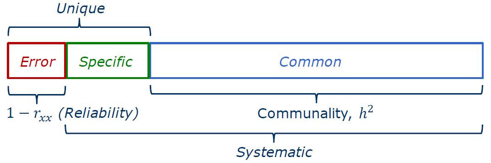
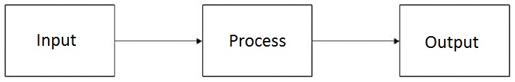
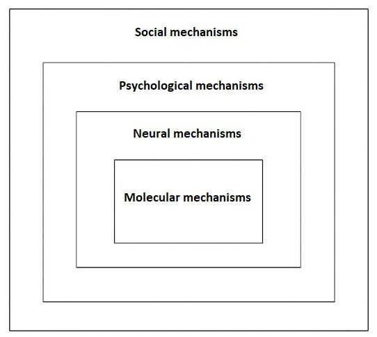
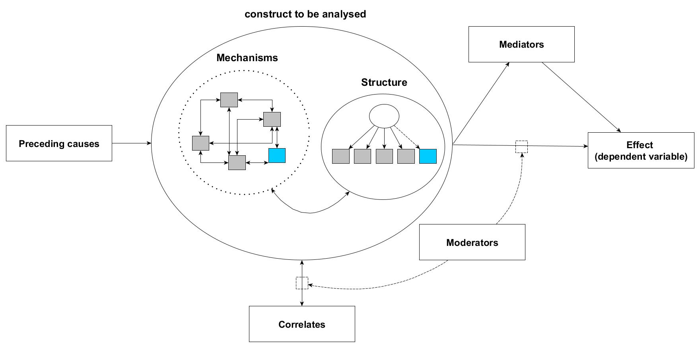
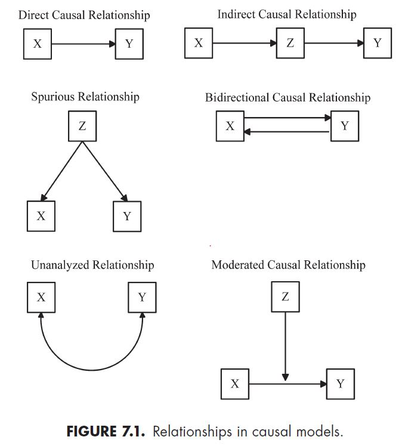

This is an [R Markdown](http://rmarkdown.rstudio.com) document. Instructions for writing these documents and background information can be found in the book [R Markdown: The Definitive Guide](https://bookdown.org/yihui/rmarkdown/). When you execute code within the document, the results appear beneath the code. 

```{r setupglobalOptions, include=FALSE}
# define default chunk options
knitr::opts_chunk$set(echo = FALSE, include = TRUE,fig.path='figure/irtgraphs-',
               fig.align='center',fig.show='asis',size='footnotesize')
```

```{r setup, include=FALSE}
# reset R environment
rm(list=ls(all=TRUE))
graphics.off()

# sets the directory of location of this script as the current directory
setwd(dirname(rstudioapi::getSourceEditorContext()$path)) 

################
# install and load packages
################
# wenn Pakete nicht bereits installiert sind, wird die Funktion diese installieren und aktivieren
usePackage <- function(p) {
  if (!is.element(p, installed.packages()[,1]))
    install.packages(p, dep = TRUE, repos = "http://cran.us.r-project.org")
  require(p, character.only = TRUE)
}
## Fehlerbehandlung Pakete in R base installieren
# options(repos="https://CRAN.R-project.org")
## load SPSS, ... data
usePackage("foreign") 

## data cleaning and summarizing
usePackage("tidyverse") 

## simulating data
usePackage("simstudy")

## simulating data
usePackage("mice")

## psychometric analysis
usePackage("moments") # skewness, kurtosis
usePackage("psych") 
usePackage("lavaan") 
usePackage("semPlot") 


## exemplify Mahalanobis Distance
usePackage("mvtnorm") 
usePackage("plotly") 
usePackage("MASS") 

## output tables
# usePackage("stargazer") # Tabellen erstellen
# usePackage("Cairo") # Umgebung, um Grafiken zu speichern

rm(usePackage)
```


```{r loaddata, include=FALSE}
# change working directory
setwd("rcodes_data")
datenLV <- foreign::read.spss("IQB-LV-2011_SchuelerInnen-Eltern_CF.sav", use.value.labels = TRUE, to.data.frame = TRUE)

### warnings() -> variables with no specified value labels (=numeric)
datenLV$Version_v1_21.01.2019 <- NULL
datenLV[,c(7,10,16,17,32:54)] <- sapply(datenLV[c(7,10,16,17,32:54)],as.character)
datenLV[,c(7,10,16,17,32:54)] <- sapply(datenLV[c(7,10,16,17,32:54)],as.numeric)
### remove single variables
datenLV$Version_v1_21.01.2019 <- NULL
datenLV$wgtSTUD <- NULL
datenLV$JKZone <- NULL
datenLV$JKrep <- NULL
# > Schulempfehlungen (id, real, erhalten)
datenLV$ESfmwC <- NULL
datenLV$ESfmvC <- NULL
datenLV$tr_Ueber <- NULL
# > Summenscores kognitive Fähigkeiten
datenLV$SKFTN2 <- NULL
datenLV$SKFTV1 <- NULL

### using wle instead of mean plausible values
datenLV <- datenLV[, str_subset(string = colnames(datenLV), pattern = "pv.", negate = TRUE)]
### change labels, recode certain variables
# labels
levels(datenLV$Emigr) <- c("Mig", "keinMig")
levels(datenLV$SBuecher) <- c("10 Buecher", "25 Buecher","100 Buecher","200 Buecher","mehr 200 Buecher")
# to numeric
# > Selbstkonzept Mathe
datenLV[, str_subset(string = colnames(datenLV), pattern = "^SSkMa_")] <- sapply(datenLV[, str_subset(string = colnames(datenLV), pattern = "^SSkMa_")], as.numeric)
# > Selbstkonzept Deutsch
datenLV[, str_subset(string = colnames(datenLV), pattern = "^SSkDe_")] <- sapply(datenLV[, str_subset(string = colnames(datenLV), pattern = "^SSkDe_")], as.numeric)
# > soziale Integration
datenLV[, str_subset(string = colnames(datenLV), pattern = "^SBezMs_")] <- sapply(datenLV[, str_subset(string = colnames(datenLV), pattern = "^SBezMs_")], as.numeric)


### create school level variables
# economic disadvantage
quantile(datenLV$EHisei, probs = c(.33,.66), na.rm = TRUE)
tmp <- aggregate(datenLV$EHisei,by=list(datenLV$idsch_FDZ),FUN=function(x) mean(x, na.rm=TRUE))
tmp$schoolEconDis <- ifelse(test = tmp$x <=  41, yes = "<33% oekonomisch benachteiligt",
       no = ifelse(test = tmp$x >  41 & tmp$x <= 55, yes = "33-66% oekonomisch mittel",
       no = ifelse(test = tmp$x > 55, yes = ">66% oekonomisch bevorzugt", no = "LOGICAL ERROR")))
tmp$x <- NULL
colnames(tmp) <- c("idsch_FDZ", "schoolEconDis")
datenLV <- merge(datenLV, tmp, by= "idsch_FDZ")
datenLV$schoolEconDis <- factor(datenLV$schoolEconDis, levels =
                                  c("<33% oekonomisch benachteiligt",
                                    "33-66% oekonomisch mittel",
                                    ">66% oekonomisch bevorzugt"))

# proportions of migrants (under / over average)
tmp <- aggregate(as.numeric(datenLV$Emigr) - 1,by=list(datenLV$idsch_FDZ),FUN=function(x) mean(x, na.rm=TRUE))
tmp$x <- 1 - tmp$x
tmp$schoolMiganteil <- ifelse(test = tmp$x <=  .2, yes = "< 20% Miganteil",
                            no = ifelse(test = tmp$x >  .2, yes = "> 20% Miganteil", no = "LOGICAL ERROR"))
tmp$x <- NULL
colnames(tmp) <- c("idsch_FDZ", "schoolMiganteil")
datenLV <- merge(datenLV, tmp, by= "idsch_FDZ")
datenLV$schoolMiganteil <- factor(datenLV$schoolMiganteil, levels =
                                  c("< 20% Miganteil",
                                    "> 20% Miganteil"))
rm(tmp) # remove object


# cor(datenLV[, str_subset(string = colnames(datenLV), pattern = "^SSkMa_", negate = FALSE)], use = "pair")
# cor(datenLV[, str_subset(string = colnames(datenLV), pattern = "^SSkDe_", negate = FALSE)], use = "pair")
# cor(datenLV[, str_subset(string = colnames(datenLV), pattern = "^SBezMs_", negate = FALSE)], use = "pair")
# 


```

# show data set

Datensatz ist der Campus-File des IQB-Ländervergleichs 2011 der Primarstufe (Zugang über \url{https://www.iqb.hu-berlin.de/fdz/Datenzugang}), Bedeutung Variablen einsichtig über Suchfunktion Skalenhandbuch.

```{r show_dataset, echo=TRUE}
dim(datenLV)

knitr::kable(datenLV[1:4,], digits = 2)

summary(datenLV)
```


## tidy and transform data

```{r recode_dat, echo=TRUE}
psych::corPlot(r = datenLV[,str_subset(string = colnames(datenLV), pattern = "^SSkMa_|^SSkDe_|^SBezMs_")])

# recode
datenLV$SSkMa_b <- 5 - datenLV$SSkMa_b
datenLV$SSkDe_b  <- 5 - datenLV$SSkDe_b
datenLV$SBezMs_c <- 5 - datenLV$SBezMs_c
datenLV$SBezMs_d <- 5 - datenLV$SBezMs_d

psych::corPlot(r = datenLV[,str_subset(string = colnames(datenLV), pattern = "^SSkMa_|^SSkDe_|^SBezMs_")])
```

## describe, visualize your data and get a first impression using R base functions

Insgesamt weisst der Datensatz N=3005 Schüler/innen in 201 Schulen auf. Die Schulen weisen folgende Anzahl von Schüler/innen auf:

```{r schools_dat, echo=TRUE}
proSchule <- aggregate(datenLV$idsch_FDZ,by=list(datenLV$idsch_FDZ),FUN=length) # using base functions
summary(proSchule$x)
rm(proSchule)
```

```{r examplebase_dat, echo=TRUE}
plot(datenLV$wle_lesen, datenLV$wle_mathe)
boxplot(datenLV$wle_lesen ~ datenLV$Emigr)
t.test(datenLV$wle_lesen ~ datenLV$Emigr) # = unequal variances t-test
```

Bestehen lineare Zusammenhänge mit einer (normalverteilten) numerischen Variablen?

```{r examplebase_dat2, echo=TRUE}
## linear regression
summary(lm(formula = wle_lesen ~ Emigr*tr_sex + SSkMa, data = datenLV))
```

Bestehen lineare Zusammenhänge mit einer binären Variablen?
empfohlene Seite: <https://www.methodenberatung.uzh.ch/de/datenanalyse_spss/zusammenhaenge/lreg.html>

```{r examplebase_dat3, echo=TRUE}
## logistic regression (if > 2 -> ordinal logistic regression)
summary(glm(Emigr ~ wle_lesen+wle_hoeren+wle_mathe,
               data = datenLV, family = binomial))
exp(coef(glm(Emigr ~ wle_lesen+wle_hoeren+wle_mathe,
             data = datenLV, family = binomial))) - 1
```

Anmerkung: Hypothestentest, logistische Regression sind die zentralen Verfahren für die **deduktive Methode** der Itementwicklung


## missing data

```{r missingdata_dat, echo=TRUE}
## missing data patterns
mdpattern <- mice::md.pattern(x = datenLV[,str_subset(string = colnames(datenLV), pattern = "^SSkMa_|^SSkDe_")], plot = TRUE, rotate.names = TRUE)
## sorted by # missing
mdpattern[match(x = sort(x = as.numeric(rownames(mdpattern)), decreasing = TRUE), table = as.numeric(rownames(mdpattern))), ]


## generate dummy of missing variable to identify potential helper variables
datenLV$missing_SSkMa_a <- ifelse(test = is.na(datenLV$SSkMa_a), yes = 1, no = 0)
helpervars <- c("wle_lesen", "wle_hoeren", "SSkDe") # include normally many more
for(v in helpervars){
  tmp <- t.test(datenLV[[v]] ~ datenLV$missing_SSkMa_a)
  if(tmp$p.value < .05){
    print(v)
    print(tmp)
  }
}

## overall missing for each single variable
round(x = sort(x = colSums(x = is.na(datenLV), na.rm = TRUE), decreasing = TRUE) / nrow(datenLV) * 100, digits = 2)
```


> Es ist zentral fehlende Daten zu ersetzen bzw. modellbasiert zu schätzen. Die zwei modernsten Ansätze, um fehlende Daten zu ersetzen sind: 

* multiple imputation, introductory book: <https://stefvanbuuren.name/fimd/>, @grund2018multiple
* full information maximum likelihood (aktuell in Mplus, aber nicht in R implementiert)

## outlier analysis

Es wird unterschieden in uni- und multivariate Ausreißer, da *structural equation modelling / CFA* multivariate Verfahren sind (mehrere UVs und AVs), ist es notwendig die Daten auf multivariate Ausreißer zu kontrollieren. Dafür eignet sich die **Mahalanobis Distance**:


```{r MahalanobisDistance1, echo=TRUE}
## exemplify Mahalanobis Distance
sigma <- matrix(c(4,1,2,1,5,4,2,4,6), ncol = 3)
cov2cor(sigma)
means <- c(0, 0, 0)
set.seed(42)
n <- 1000
x <- rmvnorm(n = n, mean = means, sigma = sigma)
d <- data.frame(x)
p4 <- plot_ly(d, x = ~ X1, y = ~ X2, z = ~ X3,
              marker = list(color = ~ X2,
                            showscale = TRUE)) %>%
  add_markers()

p4

## identify multivariate outliers
d$mahal <- mahalanobis(d, colMeans(d), cov(d))
d$p_mahal <- pchisq(d$mahal, df=2, lower.tail=FALSE)
d[d$p_mahal < .001, ]
```


```{r MahalanobisDistance2, echo=TRUE}
datenLV$mahal_SSkMa <- mahalanobis(datenLV[,str_subset(string = colnames(datenLV), pattern = "^SSkMa_")], colMeans(datenLV[,str_subset(string = colnames(datenLV), pattern = "^SSkMa_")], na.rm = TRUE), cov(datenLV[,str_subset(string = colnames(datenLV), pattern = "^SSkMa_")], use = "pairwise"))
datenLV$p_mahal_SSkMa <- pchisq(datenLV$mahal_SSkMa, df=3, lower.tail=FALSE)

## identify multivariate outliers
head(datenLV[datenLV$p_mahal_SSkMa < .001  & !is.na(datenLV$p_mahal_SSkMa), c("SSkMa_a", "SSkMa_b", "SSkMa_c", "SSkMa_d", "mahal_SSkMa", "p_mahal_SSkMa")])
sum(datenLV$p_mahal_SSkMa < .001, na.rm = TRUE)
```


```{r intravar, echo=TRUE}
datenLV$intravariability_SSkMa <- apply(datenLV[,str_subset(string = colnames(datenLV), pattern = "^SSkMa_")], MARGIN=1, FUN = sd, na.rm=TRUE)
## identify insufficient item responding using variability of answering patterns
head(datenLV[datenLV$intravariability_SSkMa == 0  & !is.na(datenLV$intravariability_SSkMa), c("SSkMa_a", "SSkMa_b", "SSkMa_c", "SSkMa_d", "mahal_SSkMa", "p_mahal_SSkMa")])
sum(datenLV$intravariability_SSkMa == 0, na.rm = TRUE)
```


# [simulation study: standardized residuals, reliability]

Using the R-Package `simstudy`  it is possible to generate all kinds of data: 

I have generated a data set with 3 items (`y1-y3`) and a data set with 7 items (`m1-m7`) for different sample sizes. The variables `latentvar` and `errorvar` are unknown and for example important in the context of classical test theory as these correspond to the true and error variance): 


```{r gendataform, include=FALSE}
def <- simstudy::defData(varname = "latentvar", dist = "normal",
                         formula = 20, variance = .5, id = "ID")
def <- simstudy::defData(def, varname = "errorvar", dist = "normal",
formula = 4, variance = .5) # independent of the latent variable
## 3 items:
def <- simstudy::defData(def, varname = "y1", dist = "normal",
                         formula = "latentvar", variance = "errorvar / 4")
def <- simstudy::defData(def, varname = "y2", dist = "normal",
                         formula = "latentvar", variance = "errorvar / 4")
def <- simstudy::defData(def, varname = "y3", dist = "normal",
                         formula = "latentvar", variance = "errorvar / 4")
## 10 items:
def <- simstudy::defData(def, varname = "m1", dist = "normal",
                         formula = "latentvar", variance = "errorvar / 4")
def <- simstudy::defData(def, varname = "m2", dist = "normal",
                         formula = "latentvar", variance = "errorvar / 4")
def <- simstudy::defData(def, varname = "m3", dist = "normal",
                         formula = "latentvar", variance = "errorvar / 4")
def <- simstudy::defData(def, varname = "m4", dist = "normal",
                         formula = "latentvar", variance = "errorvar / 4")
def <- simstudy::defData(def, varname = "m5", dist = "normal",
                         formula = "latentvar", variance = "errorvar / 4")
def <- simstudy::defData(def, varname = "m6", dist = "normal",
                         formula = "latentvar", variance = "errorvar / 4")
def <- simstudy::defData(def, varname = "m7", dist = "normal",
                         formula = "latentvar", variance = "errorvar / 4")
```

```{r gendataform2}
def
```


```{r gendata, echo=TRUE}
set.seed(111)
dt_50 <- genData(50, def); dt_50 <- as.data.frame(dt_50)
dt_200 <- genData(200, def); dt_200 <- as.data.frame(dt_200)
dt_500 <- genData(500, def); dt_500 <- as.data.frame(dt_500)
dt_100000 <- genData(100000, def); dt_100000 <- as.data.frame(dt_100000)
```

```{r correlation matrices, echo=TRUE}
round(x = cor(dt_50[, str_subset(string = colnames(dt_50), pattern = "m")]), digits = 2)
round(x = cor(dt_100000[, str_subset(string = colnames(dt_100000), pattern = "m")]), digits = 2)

round(x = cor(dt_50[, str_subset(string = colnames(dt_50), pattern = "m")]), digits = 2) - round(x = cor(dt_100000[, str_subset(string = colnames(dt_100000), pattern = "m")]), digits = 2)
```

```{r standard error of the mean, echo=TRUE}
sd(dt_50$m1) / sqrt(x = length(dt_50$m1)) 
sd(dt_100000$m1) / sqrt(x = length(dt_100000$m1)) 
```

```{r cronbachsalpha, echo=TRUE}
psych::alpha(cor(dt_50[, str_subset(string = colnames(dt_50), pattern = "m")]))$total
psych::alpha(cor(dt_200[, str_subset(string = colnames(dt_200), pattern = "m")]))$total
psych::alpha(cor(dt_100000[, str_subset(string = colnames(dt_100000), pattern = "m")]))$total


psych::alpha(cor(dt_50[, str_subset(string = colnames(dt_50), pattern = "y")]))$total
psych::alpha(cor(dt_200[, str_subset(string = colnames(dt_200), pattern = "y")]))$total
psych::alpha(cor(dt_100000[, str_subset(string = colnames(dt_100000), pattern = "y")]))$total
psych::omega(m = dt_100000[, str_subset(string = colnames(dt_100000), pattern = "y")], nfactors = 1, plot = FALSE)
```

> Zusammenfassung: 

* die Kovarianzmatrix der Population ist unbekannt und wird durch unsere Daten geschätzt (wenn N gegen unendlich geht, können wir unseren Parameterschätzungen vertrauen -> Konzept des Standardfehlers des Mittelwerts)
* Reliabilität ist abhängig von der Anzahl der Items: unter Zunahme der Anzahl der Items bei gleicher mittlerer Interkorrelation steigt die Reliabilität
* Cronbachs Alpha sollte nur unter Bedingung eines tau-äquivalenten Messmodells und vorheriger Testungs auf Eindimensionalität verwendet werden (@sijtsma2009use), sonst empfiehlt sich immer modell-basierte Reliabilitätsschätzer wie McDonald's Omega


# developing a questionnaire scale

## descreptive analysis using classical test theory
orientiert sich an Buchkapitel 7, 13 in @moosbrugger2020testtheorie

$y_i = \tau_i + \epsilon_i$, aus der Messfehlertheorie folgt die Definition der Reliabilität: $Rel(Y) = \frac{Var(T)}{Var(T) + Var(E)}$

$E(y_i) = E(\tau_i) + E(\epsilon_i)$

$E(y_i) = E(\tau_i) + 0$

über mehrere Items einer Skala lässt sich ein Punktschätzer für den wahren Wert $\tau_i$ wie folgt berechnen als Summenscore: $Y = \sum_{i=1}^p y_i$ oder besser interpretierbar als Personmittelwertmittelwert: $\bar{Y} = \frac{\sum_{i=1}^p y_i}{n}$ ! vorläufige Testwertermittlung (*Eindimensionalität, tau-äquivalenten Messmodells muss an sich gegeben sein*)

### Schwierigkeitsindex

$P_i = \frac{\sum_{v=1}^n y_{vi}}{n*max(y_i)} *100$

folgende Zahlen geben die Leichtigkeit des Items an:

```{r KTT_Schwierigkeitsindex, echo=TRUE}
datenLV[,str_subset(string = colnames(datenLV), pattern = "^SBezMs_")] <- datenLV[,str_subset(string = colnames(datenLV), pattern = "^SBezMs_")] - 1
datenLV$failitem <- rbinom(n = nrow(datenLV), size = 3, prob = .95)
head(datenLV[, c(str_subset(string = colnames(datenLV), pattern = "^SBezMs_"), "failitem")])
sum(datenLV$SBezMs_a, na.rm = TRUE) / (sum(!is.na(datenLV$SBezMs_a)) * max(datenLV$SBezMs_a, na.rm = TRUE)) * 100
sum(datenLV$SBezMs_b , na.rm = TRUE) / (sum(!is.na(datenLV$SBezMs_b)) * max(datenLV$SBezMs_b, na.rm = TRUE)) * 100
sum(datenLV$SBezMs_c , na.rm = TRUE) / (sum(!is.na(datenLV$SBezMs_c)) * max(datenLV$SBezMs_c, na.rm = TRUE)) * 100 
sum(datenLV$SBezMs_d, na.rm = TRUE) / (sum(!is.na(datenLV$SBezMs_d)) * max(datenLV$SBezMs_d, na.rm = TRUE)) * 100

sum(datenLV$failitem, na.rm = TRUE) / (sum(!is.na(datenLV$failitem)) * max(datenLV$failitem, na.rm = TRUE)) * 100

datenLV[,str_subset(string = colnames(datenLV), pattern = "^SBezMs_")] <- datenLV[,str_subset(string = colnames(datenLV), pattern = "^SBezMs_")] + 1
```
### Itemvarianz

$Var(y_i) = \frac{\sum_{v=1}^n (y_{vi} - \bar{y_i})^2}{n}$

```{r KTT_Itemvarianz, echo=TRUE}
sum((datenLV$SBezMs_a - mean(datenLV$SBezMs_a, na.rm = TRUE))^2, na.rm = TRUE) / sum(!is.na(datenLV$SBezMs_a)) # = var(datenLV$SBezMs_a , na.rm = T)
sum((datenLV$SBezMs_b - mean(datenLV$SBezMs_b, na.rm = TRUE))^2, na.rm = TRUE) / sum(!is.na(datenLV$SBezMs_b))
sum((datenLV$SBezMs_c - mean(datenLV$SBezMs_c, na.rm = TRUE))^2, na.rm = TRUE) / sum(!is.na(datenLV$SBezMs_c)) 
sum((datenLV$SBezMs_d - mean(datenLV$SBezMs_d, na.rm = TRUE))^2, na.rm = TRUE) / sum(!is.na(datenLV$SBezMs_d))

sum((datenLV$failitem - mean(datenLV$failitem, na.rm = TRUE))^2, na.rm = TRUE) / sum(!is.na(datenLV$failitem))
```

### Trennschärfe

part-whole korrigierte Trennschärfe $r_{it(i)}$: $r_{it(i)} = r_{(y_i, y(i))}$

```{r KTT_Trennschaerfe, echo=TRUE}
cor(datenLV$SBezMs_a, rowSums(datenLV[, c("SBezMs_b", "SBezMs_c", "SBezMs_d")], na.rm = TRUE), use = "complete")
cor(datenLV$SBezMs_b, rowSums(datenLV[, c("SBezMs_a", "SBezMs_c", "SBezMs_d")], na.rm = TRUE), use = "complete")
cor(datenLV$SBezMs_c, rowSums(datenLV[, c("SBezMs_a", "SBezMs_b", "SBezMs_d")], na.rm = TRUE), use = "complete")
cor(datenLV$SBezMs_d, rowSums(datenLV[, c("SBezMs_a", "SBezMs_b", "SBezMs_c")], na.rm = TRUE), use = "complete")


cor(datenLV$failitem, rowSums(datenLV[, c("SBezMs_a", "SBezMs_b", "SBezMs_c", "SBezMs_d")], na.rm = TRUE), use = "complete")
```

### Testwertverteilung
orientiert sich an Buchkapitel 8 in @moosbrugger2020testtheorie

```{r KTT_Testwertverteilung, echo=TRUE}
## liegt bereits in Daten vor
cor(rowMeans(x = datenLV[,str_subset(string = colnames(datenLV), pattern = "^SBezMs_")]), datenLV$SBezMs, use = "complete")

hist(datenLV$SBezMs, freq = FALSE)
abline(v = mean(datenLV$SBezMs, na.rm = TRUE))
lines(density(datenLV$SBezMs[!is.na(datenLV$SBezMs)]), col="red") # empirical density
lines(seq(0, 5, by=.1), dnorm(seq(0, 5, by=.1),
      mean(datenLV$SBezMs, na.rm = TRUE), sd(datenLV$SBezMs, na.rm = TRUE)), col="blue") # normal density
sd(x = datenLV$SBezMs, na.rm = TRUE)
moments::skewness(x = datenLV$SBezMs, na.rm = TRUE)
moments::kurtosis(x = datenLV$SBezMs, na.rm = TRUE) - 3 # = SPSS output
shapiro.test(x = datenLV$SBezMs)
```


für ein normorientierten Vergleich bietet sich eine z-Standardisierung $\frac{Y_v - \bar{Y}}{SD(Y)}$ an: 

```{r KTT_Testwertverteilung2, echo=TRUE}
datenLV$Zstand_SBezMs <- scale(x = datenLV$SBezMs, center = TRUE, scale = TRUE)
hist(datenLV$Zstand_SBezMs, freq = FALSE)
abline(v = mean(datenLV$Zstand_SBezMs, na.rm = TRUE))
lines(density(datenLV$Zstand_SBezMs[!is.na(datenLV$Zstand_SBezMs)]), col="red")
lines(seq(-4, 4, by=.1), dnorm(seq(-4, 4, by=.1),
      mean(datenLV$Zstand_SBezMs, na.rm = TRUE), sd(datenLV$Zstand_SBezMs, na.rm = TRUE)), col="blue")
```

## exploratory factor analysis
**induktive Methode**

an sich gehört zur KTT Testung auf Messinvarianz über die klassischen Testmodelle, jedoch muss für diese Eindimensionaltität gegeben sein, hierfür eignet sich eine sogenannte EFA

Verwendung des `psych` Paketes in R (siehe <http://personality-project.org/r/psych/HowTo/factor.pdf>), Alternativ eignet sich auch das Statistikprogramm JASP für EFA / CFA: (<https://jasp-stats.org/>)

einführende Artikel in EFA: @costello2005best, @mvududu2013factor (Anmerkung: es gibt Mischformen zwischen EFA und CFA, wie beispielsweise ESEM: @marsh2014exploratory)


! wichtig es sollte keine principal component analysis gerechnet werden (Relikt der Vergangenheit, Grundprinzipien mit EFA gleich), da hier keine **Varianzzerlegung** stattfindet. 




Ziele der explorativen Faktorenanalyse sind 

* die Reduktion der Dimension der Kovarianz- bzw. Korrelationsmatrix 
* die Identifizierung von latenten Variablen (z.B. über die Hauptachsenanalyse (Principal Axes Analyses)) und 
* die Ausdifferenzierung eines komplexen Merkmalsbereichs in homogene Teilbereiche, d.h. die Variablen werden so gruppiert, dass sie innerhalb der Gruppe möglichst hoch korreliert sind (homogen) und die Gruppen der Variablen zueinander möglichst heterogen sind. Hier wird das gleiche Ziel wie mit einer Clusteranalyse (Latente Klassenanalyse) verfolgt

EFA läuft in vier Schritten ab: 

1. vorbetrachtende Tests
2. die Wahl der Extraktionsmethode
3. die Wahl eines Abbruchkriteriums und zuletzt 
4. die Wahl der Rotationsmethode

zur eigenen Interpretation der Ergebnisse siehe Blog von Michael Clark: <https://m-clark.github.io/posts/2020-04-10-psych-explained/>

```{r EFA1, echo=TRUE}
psych::corPlot(r = datenLV[,str_subset(string = colnames(datenLV), pattern = "^SSkMa_|^SSkDe_|^SBezMs_")])

## not accounting for the non-normal / skewed data
efa1 = fa(r = datenLV[,str_subset(string = colnames(datenLV), pattern = "^SSkMa_|^SSkDe_|^SBezMs_")], nfactors = 3, rotate = "oblimin")
fa.diagram(efa1)
efa1

### accounting partly for the non-normal / skewed data using choric correlations (limited information approach)
efa2choric <- fa(r = datenLV[,str_subset(string = colnames(datenLV), pattern = "^SSkMa_|^SSkDe_|^SBezMs_")], nfactors = 3, rotate = "oblimin", fm = "wls", max.iter = 500, cor = "poly", scores = "Bartlett")
efa2choric

### model based reliability score
omega(datenLV[,str_subset(string = colnames(datenLV), pattern = "^SSkMa_|^SSkDe_|^SBezMs_")])
```

Wenn die Anzahl der zu bestimmenden Faktoren unklar ist bietet sich die Verwendung von Scree plots an:

```{r EFA2, echo=TRUE}
efa3 <- fa.parallel(x = datenLV[,str_subset(string = colnames(datenLV), pattern = "^SSkMa_|^SSkDe_|^SBezMs_")], fa = "fa",n.iter=50)
efa3
```

### classical test models / measurment invariance

Im Folgenden wollen wir die Items zu dem Matheselbstkonzept genauer analysieren - ohne die Testung von tau-äquivalentem Modell, sowie Eindimensionalität berechnen wir vorläufig nur McDonald's Omega:

```{r MI_omega, echo=TRUE}
psych::omega(datenLV[,str_subset(string = colnames(datenLV), pattern = "^SSkMa_")], nfactors = 1)
```

Um auf Messinvarianz zu testen, müssen wir das Messmodell über eine sogenannte Modellsyntax eingeben, um darauf folgend das R Paket lavaan verwenden zu können: 

Achtung: CFAs werden geschätzt mittels maximum likelihood (ML), weiter unten in Abschnitt CFA / SEM für die Daten besser geeignete Schätzmethode (jedoch ist ML hier zielführend da hiermit über den likelihood ratio test ein Modellvergleich gerechnet werden kann):


**classical test models** (Voraussetzung Reliabilitätsanalysen, Sparsamkeit des Modells; gleiches Prinzip wie Messinvarianz weiter unten)

```{r MI1, echo=TRUE}
cong.model <- '
SSmath =~ lam1*SSkMa_a + lam2*SSkMa_b + lam3*SSkMa_c + lam4*SSkMa_d

SSkMa_a ~~ var1*SSkMa_a
SSkMa_b ~~ var2*SSkMa_b
SSkMa_c ~~ var3*SSkMa_c
SSkMa_d ~~ var4*SSkMa_d

SSkMa_a ~ mean1*1
SSkMa_b ~ mean2*1
SSkMa_c ~ mean3*1
SSkMa_d ~ mean4*1
'

# identification: Fixed factor
cong.fit <-sem(cong.model, data = datenLV, std.lv = TRUE)
summary(cong.fit, standardized = TRUE, fit.measures=TRUE)
semPlot::semPaths(object = cong.fit, what = "est")


tauequi.model <- '
SSmath =~ lam1*SSkMa_a + lam2*SSkMa_b + lam3*SSkMa_c + lam4*SSkMa_d

SSkMa_a ~~ var1*SSkMa_a
SSkMa_b ~~ var2*SSkMa_b
SSkMa_c ~~ var3*SSkMa_c
SSkMa_d ~~ var4*SSkMa_d

SSkMa_a ~ mean1*1
SSkMa_b ~ mean2*1
SSkMa_c ~ mean3*1
SSkMa_d ~ mean4*1

# fix variance of SSmath factor
SSmath ~~ 1*SSmath

# constraints
lam1 == lam2
lam2 == lam3
lam3 == lam4
'

# identification: Fixed factor
tauequi.fit <-sem(tauequi.model, data = datenLV, std.lv = TRUE)
summary(tauequi.fit, standardized = TRUE, fit.measures=TRUE)

anova(cong.fit, tauequi.fit) # LRT
fit.stats <- rbind(fitmeasures(cong.fit, fit.measures = c("chisq", "df", "rmsea", "tli", "cfi", "aic")),
fitmeasures(tauequi.fit, fit.measures = c("chisq", "df", "rmsea", "tli", "cfi", "aic")))
rownames(fit.stats) <- c("configural", "weak invariance")
fit.stats


parallel.model <- '
SSmath =~ lam1*SSkMa_a + lam2*SSkMa_b + lam3*SSkMa_c + lam4*SSkMa_d

SSkMa_a ~~ var1*SSkMa_a
SSkMa_b ~~ var2*SSkMa_b
SSkMa_c ~~ var3*SSkMa_c
SSkMa_d ~~ var4*SSkMa_d

SSkMa_a ~ mean1*1
SSkMa_b ~ mean2*1
SSkMa_c ~ mean3*1
SSkMa_d ~ mean4*1

# fix variance of SSmath factor
SSmath ~~ 1*SSmath

# constraints
lam1 == lam2
lam2 == lam3
lam3 == lam4

var1 == var2
var2 == var3
var3 == var4
'

# identification: Fixed factor
parallel.fit <-sem(parallel.model, data = datenLV, std.lv = TRUE)
summary(parallel.fit, standardized = TRUE, fit.measures=TRUE)

anova(cong.fit, tauequi.fit, parallel.fit) # LRT

semPlot::semPaths(object = parallel.fit, what = "est")
```


**measurment invariance** (longitudinal data, multi-group analysis)

zur eigenen Interpretation der Ergebnisse siehe: <https://rstudio-pubs-static.s3.amazonaws.com/194879_192b64ad567743d392b559d650b95a3b.html>

```{r MI2, echo=TRUE}
CFAmodel <- ' SSmath  =~ SSkMa_a  + SSkMa_b  + SSkMa_c + SSkMa_d'
fit <- cfa(CFAmodel, data=datenLV) # ! ML 
summary(fit, fit.measures=TRUE)

table(datenLV$Emigr)
configural <- cfa(CFAmodel, data=datenLV, group = "Emigr")
summary(configural, fit.measures=TRUE)

weak.invariance <- cfa(CFAmodel, data=datenLV, group = "Emigr", group.equal = "loadings")
summary(weak.invariance, fit.measures = TRUE)

anova(weak.invariance, configural) # LRT
fit.stats <- rbind(fitmeasures(configural, fit.measures = c("chisq", "df", "rmsea", "tli", "cfi", "aic")),
fitmeasures(weak.invariance, fit.measures = c("chisq", "df", "rmsea", "tli", "cfi", "aic")))
rownames(fit.stats) <- c("configural", "weak invariance")
fit.stats


strong.invariance <- cfa(CFAmodel, data=datenLV, group = "Emigr", group.equal = c( "loadings", "intercepts"))
summary(strong.invariance, fit.measures = TRUE)

anova(strong.invariance, weak.invariance, configural)

strict.invariance <- cfa(CFAmodel, data=datenLV, group = "Emigr", group.equal = c( "loadings", "intercepts", "residuals"))

anova(strict.invariance, strong.invariance, weak.invariance, configural)
```

## confirmatory factor analysis

Verwendung des `lavaan` Paketes in R (siehe <https://lavaan.ugent.be/>), google group lavaan (<https://groups.google.com/g/lavaan>); es empfiehlt sich jedoch für komplexe Analysen Mplus zu verwenden (FIML, Bayesian SEM, ...)

wichtigstes Grundlagenbuch zu SEM: @bollen1989structuralequations

### short theoretical: focus the structural modelling perspective
**deduktive Methode**


Context-Process-Input-Output model (bekannt in deutschsprachigen Raum durch @ditton2000qualitatskontrolle, entwickelt von @stufflebeam1971relevance; klare Ausführungen in @keller2014strukturelle):

 

Dies lässt sich zusammenbauen zu einem nomologischen Netzwerk (= Testung Konstruktvalidität): 


Welche möglicherweise Variablen interessant sind lässt sich aus einer graphischen theoretischen Ausarbeitung (Pfaddiagramm) schrittweise aufbauen (Kapitel 7 "causal models" in @jaccard2020theory):




### CFA (measurement model)

Abschnitt CFA / SEM orientiert sich an Kapitel 9-12 in @hair2019multivariate: 

an sich sollten die einzelnen Messmodelle (CFAs) getrennt berechnet werden, hier wird jedoch aus Zeitdrücken direkt eine CFA erster Ordnung (*first order CFA*) für alle Messmodelle, die im Strukturgleichungsmodell verwendet werden gerechnet: 

```{r CFA1, echo=TRUE}
firstorderCFA <- '
SSmath =~ SSkMa_a + SSkMa_b + SSkMa_c + SSkMa_d
SSgerman =~ SSkDe_a + SSkDe_b + SSkDe_c + SSkDe_d

SozInt =~ SBezMs_a + SBezMs_b + SBezMs_c + SBezMs_d

Abilities =~ wle_lesen + wle_hoeren + wle_mathe
'

# identification: Fixed factor
fit <-sem(firstorderCFA, data = datenLV, std.lv = TRUE)
summary(fit, standardized = TRUE, fit.measures=TRUE)
semPlot::semPaths(object = fit, what = "est")
```

To account for the non-normal distribution of the questionnaire items and the small sample, the DWLS estimator was used and the $X^2$ statistic was mean and variance adjusted (e.g. chapter 11 in @hancock2013structural):

! limited information approach; FIML, Bayesian SEM is possible in Mplus


```{r CFA2, echo=TRUE}
datenLV[,c("SSkMa_a",
        "SSkMa_b",
        "SSkMa_c",
        "SSkMa_d",
        "SSkDe_a",
        "SSkDe_b",
        "SSkDe_c",
        "SSkDe_d",
        "SBezMs_a",
        "SBezMs_b",
        "SBezMs_c",
        "SBezMs_d")] <-
  lapply(datenLV[,c("SSkMa_a",
        "SSkMa_b",
        "SSkMa_c",
        "SSkMa_d",
        "SSkDe_a",
        "SSkDe_b",
        "SSkDe_c",
        "SSkDe_d",
        "SBezMs_a",
        "SBezMs_b",
        "SBezMs_c",
        "SBezMs_d")], ordered)

head(datenLV$SSkMa_a)

firstorderCFA <- '
SSmath =~ SSkMa_a + SSkMa_b + SSkMa_c + SSkMa_d
SSgerman =~ SSkDe_a + SSkDe_b + SSkDe_c + SSkDe_d

SozInt =~ SBezMs_a + SBezMs_b + SBezMs_c + SBezMs_d

Abilities =~ wle_lesen + wle_hoeren + wle_mathe
'

# identification: Marker variable method
fit <- sem(firstorderCFA, data = datenLV,
           ordered = c("SSkMa_a",
        "SSkMa_b",
        "SSkMa_c",
        "SSkMa_d",
        "SSkDe_a",
        "SSkDe_b",
        "SSkDe_c",
        "SSkDe_d",
        "SBezMs_a",
        "SBezMs_b",
        "SBezMs_c",
        "SBezMs_d"))

summary(fit, standardized = TRUE, fit.measures=TRUE)
semPlot::semPaths(object = fit, what = "est")
```


### SEM (measurement model + structural model)


```{r SEM1, echo=TRUE}
SEMmodel <- '
  # measurement models
SSmath =~ SSkMa_a + SSkMa_b + SSkMa_c + SSkMa_d
SSgerman =~ SSkDe_a + SSkDe_b + SSkDe_c + SSkDe_d

SozInt =~ SBezMs_a + SBezMs_b + SBezMs_c + SBezMs_d

Abilities =~ wle_lesen + wle_hoeren + wle_mathe

  # regressions (+2 dummies)
  Abilities ~ SSmath + SSgerman + SozInt + Emigr + tr_sex + EHisei
'

# identification: Marker variable method
fit <- sem(SEMmodel, data = datenLV,
           ordered = c("SSkMa_a",
        "SSkMa_b",
        "SSkMa_c",
        "SSkMa_d",
        "SSkDe_a",
        "SSkDe_b",
        "SSkDe_c",
        "SSkDe_d",
        "SBezMs_a",
        "SBezMs_b",
        "SBezMs_c",
        "SBezMs_d"))

summary(fit, standardized = TRUE, fit.measures=TRUE)
semPlot::semPaths(object = fit, what = "est")
```

## short: item response theory

wörtliche Anmerkungen, wenn Zeit übrig

## short: longitudinal data / multi-group analysis

wörtliche Anmerkungen, wenn Zeit übrig

# References
